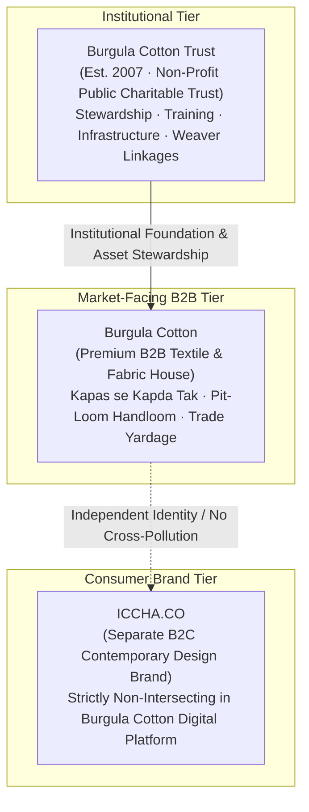
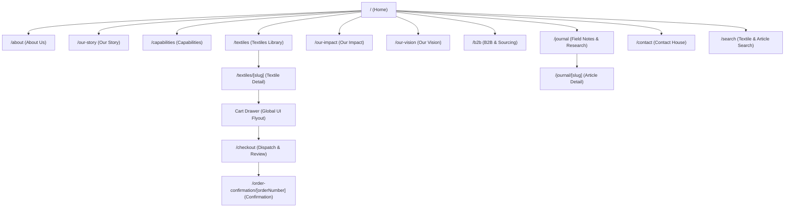
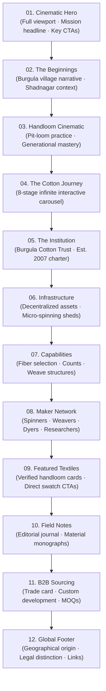
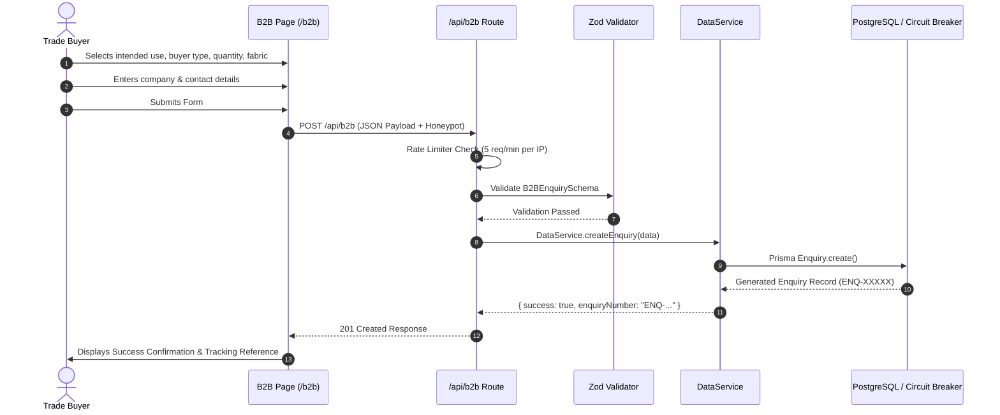
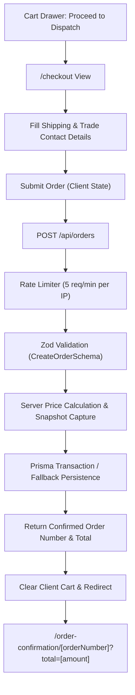
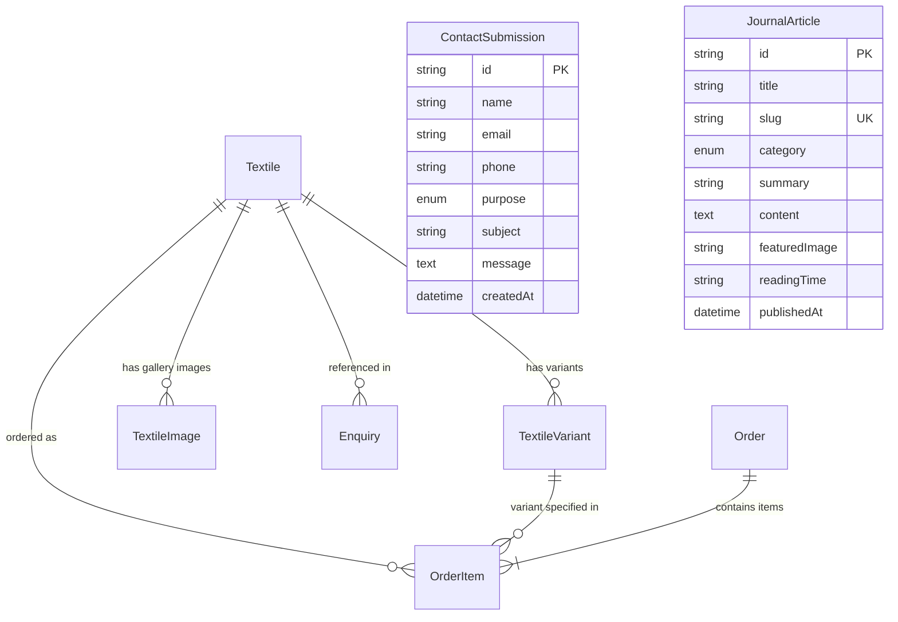

# Burgula Cotton — Product Requirements Document

**Document Status:** Official Product Source of Truth  
**Version:** 1.0  
**Product:** Burgula Cotton Digital Platform  
**Document Type:** Product Requirements Document  
**Status:** Approved for Implementation  
**Last Updated:** 2026-09-10  
**Application:** Burgula Cotton Web Platform  
**Target Repository:** `cotton trust burgula` (Next.js 15, Prisma 6, PostgreSQL)  

> This document is the authoritative Product Requirements Document for the Burgula Cotton digital platform. Product, design, engineering, content, QA, and future feature decisions should reference this document. Any requirement that is not defined here must be treated as an open product decision until explicitly approved.

### Document History

| Version | Date | Status | Description |
|---|---|---|---|
| 1.0 | 2026-09-10 | Approved | Initial official production PRD |

---

## Table of Contents
1. [Executive Summary](#1-executive-summary)
2. [Product Vision](#2-product-vision)
3. [Business Objectives](#3-business-objectives)
4. [Product Principles](#4-product-principles)
5. [Brand Architecture](#5-brand-architecture)
6. [Target Users & Personas](#6-target-users--personas)
7. [User Problems](#7-user-problems)
8. [Information Architecture](#8-information-architecture)
9. [Website Sitemap](#9-website-sitemap)
10. [Homepage Requirements](#10-homepage-requirements)
11. [About / Story / Trust Requirements](#11-about--story--trust-requirements)
12. [Capabilities Requirements](#12-capabilities-requirements)
13. [Textiles Requirements](#13-textiles-requirements)
14. [Textile Detail Requirements](#14-textile-detail-requirements)
15. [Our Impact Requirements](#15-our-impact-requirements)
16. [Our Vision Requirements](#16-our-vision-requirements)
17. [B2B / Trade Requirements](#17-b2b--trade-requirements)
18. [Sample / Swatch Requirements](#18-sample--swatch-requirements)
19. [Checkout & Order Requirements](#19-checkout--order-requirements)
20. [Contact Requirements](#20-contact-requirements)
21. [Journal / Field Notes Requirements](#21-journal--field-notes-requirements)
22. [Search Requirements](#22-search-requirements)
23. [Database Requirements](#23-database-requirements)
24. [API Requirements](#24-api-requirements)
25. [Security Requirements](#25-security-requirements)
26. [Accessibility Requirements](#26-accessibility-requirements)
27. [SEO Requirements](#27-seo-requirements)
28. [Performance Requirements](#28-performance-requirements)
29. [Error / Loading / Empty States](#29-error--loading--empty-states)
30. [Content Governance](#30-content-governance)
31. [Analytics & Observability](#31-analytics--observability)
32. [Current Scope](#32-current-scope)
33. [Phase 2](#33-phase-2)
34. [Future Roadmap](#34-future-roadmap)
35. [User Journeys](#35-user-journeys)
36. [Acceptance Criteria](#36-acceptance-criteria)
37. [Non-Functional Requirements](#37-non-functional-requirements)
38. [Production Release Checklist](#38-production-release-checklist)
39. [Open Questions / Decisions Required](#39-open-questions--decisions-required)
40. [Final Requirement Traceability Matrix](#40-final-requirement-traceability-matrix)

---

## 1. Executive Summary

Burgula Cotton is a digital platform representing a market-facing premium B2B handloom textile and fabric house rooted in Shadnagar Mandal, Telangana, India. Built upon the institutional groundwork of the Burgula Cotton Trust (established in 2007), the platform serves as a modern bridge between decentralized village-level cotton spinning, pit-loom handloom weaving clusters, and commercial trade partners across design, fashion, architecture, and hospitality.

The platform provides verified textile discovery, material education, trade sampling (swatches and sample cuts), bespoke manufacturing enquiry workflows, and field research documentation. Unlike consumer marketplaces or conventional non-profit portals, Burgula Cotton is positioned as an understated, material-led, authoritative fabric house where material authenticity, technical textile transparency, and institutional stewardship take precedence over mass commerce.

---

## 2. Product Vision

To establish the benchmark digital presence for decentralized Indian handloom cotton, where the entire value chain—*from cotton to yarn to cloth*—is presented with uncompromising material fidelity, technical precision, and quiet editorial elegance.

### Core Proposition
> **"cotton → yarn → handloom fabric"**

### Core Brand Phrase
> **"From cotton to yarn to cloth, rooted in Telangana."**

### By-Line
> **"In Cotton We Trust."**

### Overall Storytelling Progression
1. **Fabric** (The immediate sensory, tactile, and structural output)
2. **Material** (Unbaled, gentle-staple desi cotton, natural pectin, unbleached kora)
3. **Making** (Decentralized ring spinning, traditional Telangana pit-looms, fermentation vats)
4. **People** (Farmers, spinners, generational weaver families, dyers, researchers)
5. **Purpose** (Sustainable rural livelihoods, local value retention, institutional resilience)

### Visual & Product Character
- **Quiet & Understated:** Generous whitespace, disciplined neutral palettes (warm ecru `#FAF8F5`, bone, charcoal `#141312`, madder accents).
- **Editorial & Material-Led:** Photography focused on weave macro-textures, selvedges, loom tension, and unbaled yarn fibers.
- **Contemporary & Refined:** Modern typography pairings (serif editorial headings with geometric sans body copy), sleek CSS modules, and fluid transitions.
- **Authentic & Non-Nostalgic:** Avoids folkloric heritage clichés; treats handloom as a viable, forward-looking contemporary industrial practice.

---

## 3. Business Objectives

### 3.1 Primary Business Objectives
1. **Commercial Positioning:** Position Burgula Cotton as a credible, premium B2B textile producer for professional designers, apparel labels, and institutional buyers.
2. **Lead Generation:** Generate qualified, high-intent B2B trade enquiries for wholesale yardage, custom weave developments, and contract manufacturing.
3. **Sample Acquisition Flow:** Streamline physical textile sample requests (swatches and 1m cuts) to accelerate the trade procurement cycle.
4. **Material Transparency:** Provide verified technical specifications (counts, weave structures, widths, finishes) to eliminate procurement ambiguity.

### 3.2 Secondary Objectives
1. **Institutional Communication:** Articulate the mission, history (est. 2007), and community stewardship of the Burgula Cotton Trust without diminishing the commercial textile identity.
2. **Thought Leadership & Research:** Publish technical field notes and artisan research via the Journal to attract researchers, academic partners, and specialized buyers.
3. **Ecosystem & Capability Showcase:** Detail the decentralized infrastructure (ginning, micro-spinning, pit-looms, natural dye units) to substantiate production claims.

### 3.3 Future Objectives
1. **Wholesale Account Portals:** Enable authenticated trade accounts with volume-tiered pricing, lead-time tracking, and reserved inventory allocation.
2. **Traceability Ledger:** Digital batch passports linking specific fabric yardage directly to farmer harvest groups and specific pit-loom weavers.
3. **Global Logistics & Multi-Currency:** Direct integration for international sample dispatches, customs documentation, and commercial invoice settlement.

---

## 4. Product Principles

1. **Material-First, Not Market-First:** The fabric itself—its weight, count, drape, and yarn character—must lead all interface decisions.
2. **Truth in Specification:** Never present estimated or unverified technical data. What is listed as 28s handspun must be physical 28s handspun.
3. **Institutional Dignity:** Present weavers and spinners as skilled technical practitioners and generational masters, never as subjects of charity or distress narrative.
4. **Frictionless B2B Discovery:** Professional buyers need rapid access to counts, widths, MOQs, and lead times without forced registration barriers.
5. **Authoritative Server Control:** Commercial terms, swatch prices, and order calculations are strictly governed by server-side business logic, preventing client tampering.
6. **Zero Performance Compromise:** Lightweight asset delivery, semantic markup, zero unnecessary client-side dependencies, and complete accessibility compliance.

---

## 5. Brand Architecture



### Brand Entity Definitions
- **Burgula Cotton Trust:** The institutional entity established in 2007 in Telangana. Public charitable, non-political, secular foundation managing infrastructure, community mobilization, weaver pit-looms, and decentralized yarn development.
- **Burgula Cotton:** The market-facing, commercial B2B textile house presented on this platform. It engages with designers, buying houses, garment manufacturers, and architects.
- **ICCHA.CO:** A completely distinct, direct-to-consumer lifestyle/garment brand. **Strict constraint:** ICCHA.CO products, branding, or consumer retail promotions must *never* be introduced into or merged with the Burgula Cotton B2B web platform.

### Product & Commercial Boundary
- **Not a Generic E-Commerce Marketplace:** The website is deliberately designed as a high-end textile house, **not** an open e-commerce catalog or multi-vendor marketplace.
- **Curated Commerce Hierarchy:** Transactional functionality is strictly limited to curated physical swatches and 1m sample cuts to facilitate trade evaluation. Full-scale wholesale production yardage is initiated via structured B2B trade enquiries.
- **No Public Admin Dashboard:** There is no public-facing admin dashboard or seller management portal; internal management is handled out-of-band.

---

## 6. Target Users & Personas

### Persona Matrix

| Persona ID | Role | Key Objective | Information Needs | Primary Pain Point | Expected Outcome | Primary CTA |
| :--- | :--- | :--- | :--- | :--- | :--- | :--- |
| **PERS-01** | Textile / Fashion Designer | Sourcing distinctive natural fabrics for runway/capsule collection | Yarn count, tactile drape, macro weave images, swatch availability | Mill-made fabrics look generic; artisanal fabrics have unreliable counts | Order swatches to test drape and tactile handfeel | `Request Swatch` |
| **PERS-02** | Apparel / Fashion Label Founder | Securing consistent handloom production yardage (100m–1,000m) | MOQs, batch lead times, colorfastness, width, repeatable supply | Artisanal weavers disappearing mid-production; lack of commercial timelines | Submit commercial enquiry with timeline and MOQ confirmation | `Start B2B Trade Enquiry` |
| **PERS-03** | Garment Manufacturer / Sourcing Agent | Contract manufacturing yardage matching strict garment tech-packs | GSM, width, shrinkage rates, tensile strength, yarn count consistency | Handloom irregularities jamming industrial cutting tables | Access full technical parameter matrix; request 1m sample cut | `Request 1m Sample` |
| **PERS-04** | Architect / Interior Designer | Contract upholstery, drapery, wall paneling for sustainable projects | Fabric width, abrasion resistance, natural dyes, flame behavior | Commercial fabrics lack authentic organic narrative and texture | Review specification matrix; order multi-color swatch kit | `+ Swatch` |
| **PERS-05** | Hospitality / Institutional Buyer | Custom bespoke bed linens, uniform cloth, or dining textiles | Volume capacity, washing stability, bespoke weaving capabilities | Inability of traditional craft clusters to handle institutional scale | Review Capabilities & Infrastructure; initiate trade dialogue | `Start B2B Fabric Enquiry` |
| **PERS-06** | Retail / Professional Fabric Buyer | Stocking curated authentic handloom yardage in textile specialty stores | Wholesale pricing structure, seasonal consistency, material story | Fragmented sourcing channels across rural India without quality checks | Inquire for wholesale swatch folder and commercial terms | `Start B2B Trade Enquiry` |
| **PERS-07** | Researcher / Textile Academic | Studying decentralized spinning and traditional pit-loom techniques | Fiber origin, unbaled spinning mechanics, village ecosystem history | Craft literature often full of marketing fluff rather than technical truth | Read Field Notes / Journal; explore Our Story | `Read Field Notes` |
| **PERS-08** | General Brand / Institutional Visitor | Understanding the Burgula model and community stewardship | Trust history, mission, village location, foundation purpose | Confusion between commercial brands and genuine grassroots trusts | Explore About Us & Our Impact; review Trust principles | `About the Trust` |
| **PERS-09** | Enterprise Procurement Officer | Vendor due diligence, compliance, legal registration, reliability | Business legitimacy, GST/tax adherence, production assets | Unregistered informal craft entities incapable of B2B invoicing | Review Capabilities, download specs, initiate formal RFP | `Start B2B Trade Enquiry` |

---

## 7. User Problems

1. **The Handloom Reliability Deficit:** Trade buyers hesitate to specify handloom because informal rural weavers often lack standardized yarn counts, lead-time adherence, and repeatability.
2. **The "NGO Cliché" Dilemma:** Sourcing agents dismiss craft trust websites that present fabrics through sentimental charity appeals rather than rigorous technical specifications and commercial readiness.
3. **Opaque Value Chains:** Mainstream commercial cotton uses highly compressed industrial bales, chemical sizing, and untraceable multi-tier spinning, stripping the cotton of its natural character.
4. **Sampling Friction:** Designers need physical swatch swatches quickly (2–3 days) to pin to moodboards, but craft clusters often require weeks of manual phone coordination just to post a swatch.
5. **Lack of Technical Documentation:** Architects and apparel production managers need verifiable GSM, warp/weft counts, and shrinkage indices—data historically missing in the handloom sector.

---

## 8. Information Architecture



### Route Purpose & Disposition
- `/`: Central brand narrative, process synthesis, featured textiles, and entry points.
- `/about`: Institutional profile of Burgula Cotton Trust (est. 2007), charter, and practice.
- `/our-story`: Narrative deep-dive into Shadnagar Mandal, *Kapas se Kapda Tak*, and unbaled yarn.
- `/capabilities`: Detailed breakdown of physical production stages, machinery, and custom development.
- `/textiles`: Complete searchable and filterable material catalog with technical cards.
- `/textiles/[slug]`: Deep technical matrix, macro photography, and sample purchase/B2B CTAs.
- `/our-impact`: Livelihood security, maker relationships, and cluster infrastructure preservation.
- `/our-vision`: Long-term decentralized industrial roadmap and agrarian resilience.
- `/b2b`: Dedicated high-intent trade enquiry form for volume, lead times, and bespoke weaves.
- `/checkout`: Minimalist sample dispatch address collection with server-authoritative totals.
- `/order-confirmation/[orderNumber]`: Immutable order receipt with reference number and confirmed total.
- `/journal`: Editorial field notes and technical monographs.
- `/journal/[slug]`: Long-form article reading experience.
- `/contact`: General, institutional, and fabric consultation inquiries.
- `/search`: Multi-entity real-time search across textiles and journal entries.

---

## 9. Website Sitemap

| URL Path | Route Type | Rendering Strategy | Key Components | Revisit Frequency | SEO Priority |
| :--- | :--- | :--- | :--- | :--- | :--- |
| `/` | Page | Static (ISR) | Hero, Carousel, FabricGrid, JournalSection | Weekly | 1.0 |
| `/about` | Page | Static | NarrativeGrid, TrustCharter, LeadershipValues | Monthly | 0.8 |
| `/our-story` | Page | Static | StoryTimeline, ProcessNarrative, VisualArchive | Monthly | 0.8 |
| `/capabilities` | Page | Static | ProcessMatrix, TechSpecs, CapabilityCards | Monthly | 0.8 |
| `/textiles` | Page | Static (Revalidated) | FilterToolbar, FabricGrid, SwatchAction | Weekly | 0.9 |
| `/textiles/[slug]` | Dynamic Page | Dynamic (SSR / On-Demand) | DetailClient, SpecMatrix, RelatedGrid, JsonLd | Weekly | 0.9 |
| `/our-impact` | Page | Static | ImpactPillars, MakerNetwork, NarrativeStats | Monthly | 0.8 |
| `/our-vision` | Page | Static | VisionManifesto, RoadmapCards, AgrarianContext | Monthly | 0.8 |
| `/b2b` | Page | Static / Client Form | B2BForm, SourcingTerms, MOQSpecs | Monthly | 0.8 |
| `/checkout` | Page | Client Form | CheckoutForm, OrderSummary, PriceValidator | Never (Noindex) | 0.3 |
| `/order-confirmation/[orderNumber]` | Dynamic Page | Dynamic (SSR) | OrderBadge, ReferenceDisplay, DeliveryTimeline | Never (Noindex) | 0.1 |
| `/journal` | Page | Static | CategoryTabs, ArticleGrid, SearchBar | Weekly | 0.7 |
| `/journal/[slug]` | Dynamic Page | Dynamic (SSR) | ArticleBody, AuthorMeta, RelatedArticles | Monthly | 0.7 |
| `/contact` | Page | Static / Client Form | ContactForm, LocationDetails, PurposeSelector | Monthly | 0.6 |
| `/search` | Page | Client Interactive | SearchInput, FilterPills, UnifiedResultList | Weekly | 0.5 |
| `/sitemap.xml` | Utility | Server-Generated XML | Stable LastMod generator | Weekly | 0.5 |
| `/robots.txt` | Utility | Server-Generated Text | Production crawler directives | Monthly | 0.5 |

---

## 10. Homepage Requirements

The homepage is composed of 12 modular sections designed to transition the visitor from cinematic immersion to material proof, institutional trust, and commercial conversion.



### 10.1 Section-by-Section Specifications

#### Section 01: Full-Screen Cinematic Hero
- **Business Purpose:** Hook trade and design visitors immediately; establish high-end aesthetic credibility.
- **Content:** Headline: "Rooted in cotton. Built for the future."; Subtext: "Burgula Cotton is building on an existing cotton and textile foundation to create a stronger future for farmers, weavers, artisans, enterprises and the wider community."; Location tag: "BURGULA · SHADNAGAR MANDAL · TELANGANA".
- **Interaction & Responsive:** Full viewport height (`min-height: 100vh`), optimized high-resolution harvest imagery (`priority`), subtle gradient overlay for legibility.
- **CTAs:** `EXPLORE OUR STORY` (`/our-story`), `OUR VISION` (`/our-vision`).

#### Section 02: The Beginnings / Story Intro
- **Business Purpose:** Frame the enterprise not as a startup or arbitrary commercial brand, but as an organic outgrowth of a rural agrarian cotton belt.
- **Content:** "The story begins in Burgula"; historical grounding in cotton cultivation; closing callout: *"Burgula is not starting from zero."*
- **Layout:** 2-column grid (`1fr 1.15fr` on desktop); aerial landscape visual on left, editorial text block on right.
- **CTA:** `Read Our Story →` (`/our-story`).

#### Section 03: Handloom Practice Cinematic
- **Business Purpose:** Emphasize weaving as skilled technical labor and material artistry.
- **Content:** "Where tradition becomes fabric"; focus on Telangana pit-looms, unbaled yarn handfeel, and breathable weave densities.
- **Media:** Full-bleed ambient loom imagery with overlay text container.
- **CTA:** `Explore Fabrics` (`/textiles`).

#### Section 04: The Cotton Journey (8-Stage Supply Chain)
- **Business Purpose:** Deconstruct the decentralized supply chain; substantiate the "cotton to yarn to cloth" proposition.
- **Container Geometry:** Centered layout using approximately `70vw` on desktop (`max-width: 1400px`, `margin: 0 auto`), bounded by ~15% whitespace on left and right for an editorial feel.
- **The 8 Verified Stages:**
  1. `STAGE 1: Farmer` — Cotton grown on land around Burgula by farming households.
  2. `STAGE 2: Cotton` — Raw cotton collected, sorted and graded before processing.
  3. `STAGE 3: Yarn` — Carding, drawing and spinning turn fibre into usable yarn.
  4. `STAGE 4: Design` — Counts, colour and weave decided before the warp is set.
  5. `STAGE 5: Handloom` — Weavers translate yarn into fabric, metre by metre.
  6. `STAGE 6: Fabric` — Woven cloth checked, finished and prepared for use.
  7. `STAGE 7: Value addition` — Finishing, stitching and product making close the loop.
  8. `STAGE 8: Market` — Fabric and products reach buyers beyond the village.
- **Carousel Interaction Mechanics:**
  - Auto-scrolling ticker with configurable pause on mouse hover and keyboard focus.
  - Infinite looping with seamless cloned item buffer.
  - Manual step buttons (`<` and `>`) with ARIA labels and active slide dot pagination.
  - Keyboard navigation (Left/Right Arrow keys navigate active slides).
  - Accessibility: Respects `prefers-reduced-motion` by disabling automatic scroll transitions and converting to static keyboard-steppable cards.

#### Section 05: The Institution (Burgula Cotton Trust)
- **Business Purpose:** Communicate institutional stability, land stewardship, and public charitable status.
- **Content:** Est. 2007; stewardship of existing land, machinery, and community mobilization; cluster planning.
- **Visual:** Split layout with facility/infrastructure photography and bulleted charter principles.
- **CTA:** `About the Trust & Practice` (`/about`).

#### Section 06: Infrastructure Showcase
- **Business Purpose:** Prove physical production capability; differentiate from middlemen/traders who own no looms or processing assets.
- **Component:** `<InfrastructureSection />` detailing land footprint, decentralized spinning sheds, pit-loom work sheds, and natural dye water tanks.

#### Section 07: Capabilities Profile
- **Business Purpose:** Technical specification summary for commercial buyers.
- **Content:** 7 discrete capability blocks: (01) Cotton Selection, (02) Yarn (27–30s unbaled count), (03) Weaving (Pit-loom plain, twill, double-cloth), (04) Fabric Development (custom widths up to 48"), (05) Finishing (Kora, madder, indigo), (06) Quality Assurance (tensile, shrinkage inspection), (07) Bespoke Development (MOQ from 50m).
- **CTA:** `View Capabilities Profile →` (`/capabilities`).

#### Section 08: Maker Network
- **Business Purpose:** Celebrate human capital without condescension; document generational artisanal partnerships.
- **Content:** 4 Pillars: Generational Weavers, Yarn Machine Operators, Natural Dye Artisans, Researchers & Designers.

#### Section 09: Featured Textiles Library
- **Business Purpose:** Direct commercial conversion; show actual in-stock fabric qualities with live sample purchasing.
- **Data Source:** `DataService.getTextiles({ isFeatured: true })`.
- **Component:** Grid of `<FabricCard />` components (Server Components) displaying macro texture toggle, specs, and `+ Swatch` trigger.
- **CTA:** `View Complete Fabric Library →` (`/textiles`).

#### Section 10: Field Notes / Research Journal
- **Business Purpose:** Demonstrate technical depth, process documentation, and academic credibility.
- **Data Source:** Latest 3 published articles from `DataService.getJournalArticles()`.
- **Content:** Card with featured image, category pill, reading time estimate, title, and excerpt.
- **CTA:** `View All Field Notes →` (`/journal`).

#### Section 11: B2B Sourcing Callout
- **Business Purpose:** Conversion capture for institutional clients, hotel developers, and fashion houses.
- **Card Content:** Dark surface container; headline: "Textiles for Purpose"; highlights custom specifications, traceable origin, and wholesale MOQ parameters.
- **CTAs:** `Start B2B Trade Enquiry` (`/b2b`), `View Development Workflow` (`/capabilities`).

#### Section 12: Global Footer
- **Content:** Full navigational taxonomy, legal trust distinction note, geographical origin coordinates, copyright, and trade CTA.

---

## 11. About / Story / Trust Requirements

### 11.1 Purpose & Narrative Boundaries
The `/about` and `/our-story` routes document the foundational history of the Burgula Cotton Trust. 

### 11.2 Verified Historical Anchor Points
- **Foundation Year:** Established in 2007 in Shadnagar Mandal, Telangana.
- **Charter:** Registered public charitable, non-profit, secular trust.
- **Core Genesis:** Connected with rural decentralization initiatives including the Decentralized Cotton Yarn Project.
- **Core Philosophy:** *"Kapas se Kapda Tak, Ek Gaon Mein"* (From raw cotton to woven cloth within the village ecosystem).
- **Unbaled Cotton Innovation:** Eliminates industrial hydraulic baling presses that crush fiber cuticles; preserves natural cotton wax, pectin, softness, and resilience.

### 11.3 Content Restrictions [STRICT]
- Do **NOT** invent specific production volumes, hectares under cultivation, or unverified farmer family headcounts.
- Do **NOT** make unsupported claims of "100% Certified Organic GOTS" unless official certification documentation is verified by leadership.
- Explicitly mark unverified community narratives as `[REQUIRES CONTENT VERIFICATION]`.

---

## 12. Capabilities Requirements

The `/capabilities` route serves as the technical manufacturing prospectus for commercial clients.

### 12.1 Supported Production Parameters
- **Fiber:** Indian staple desi and regional cotton grown in Telangana rain-fed belts.
- **Spinning Method:** Decentralized micro-spinning; unbaled, gentle carding; unpressed roving.
- **Standard Yarn Counts:** 27s, 28s, 30s single handspun / semi-mechanized unbaled yarn.
- **Weaving Technologies:** Traditional wooden pit-looms, frame handlooms with fly-shuttle attachments.
- **Weave Structures:** Balanced Plain Weave (1x1), 2/1 Twill, 2/2 Twill, Oxford variation, Jamdani structural extra-weft accents.
- **Finished Widths:** Standard 44 inches (112 cm) up to bespoke 48 inches (122 cm).
- **Loom Finishes:** Loom-State Kora (unwashed, unbleached, sizing intact), Soft Water Washed, Natural Plant-Dye Bath.
- **Minimum Order Quantities (MOQ):**
  - Swatch Sampling: 1 unit (approx. 15cm x 15cm).
  - Sample Cut: 1 meter.
  - Bespoke Loom Development: 50 meters.
  - Bulk Production Yardage: 100 to 500+ meters per batch.

---

## 13. Textiles Requirements

### 13.1 Catalog Experience (`/textiles`)
- **Header:** Editorial framing highlighting loom-state qualities and regional weaving clusters.
- **Filter Toolbar:**
  - Weave selector: All, Plain Weave, Twill, Jamdani Accent.
  - Yarn Count filter: All, 27-30s Handspun.
  - Search input: Real-time debounced text query matching title, code, description.
  - Active filter badges with one-click clear mechanism.
- **Display Matrix:** Responsive CSS Grid (`repeat(auto-fit, minmax(320px, 1fr))`).

### 13.2 FabricCard Component Specification
- **Component Architecture:** Server-rendered component (`FabricCard.tsx`) with client interactive leaf component (`AddToSwatchBagButton.tsx`).
- **Visual Elements:**
  - Primary hero image (lifestyle drape).
  - Secondary macro image (revealed on card hover with smooth scale transition).
  - "Macro Texture" pill badge overlay.
  - Textile Code (e.g., `BC-KK-2801`) in uppercase accent styling.
  - Status indicator: "In Archive & Production" vs "Bespoke Development".
  - Title linking to `/textiles/[slug]`.
  - 2-line truncated narrative excerpt.
  - 4-parameter specification strip: Weave, Yarn, Weight (GSM), Width.
  - Dual action button row: `View Textile Specs` (secondary button) + `+ Swatch` (primary button with cart badge trigger).

---

## 14. Textile Detail Requirements

### 14.1 Route Specification (`/textiles/[slug]`)
- **Metadata Generation:** Dynamic `generateMetadata` fetching textile by slug; populates OpenGraph tags, canonical URLs, and dynamic page titles.
- **Structured Data:** Injects Schema.org `Product` schema and `BreadcrumbList` schema via `<JsonLd />`.

### 14.2 Page Layout & Feature Sections
1. **Breadcrumb Bar:** Semantic `<nav aria-label="Breadcrumb">` linking `Home / Textiles / [Fabric Name]`.
2. **Top Grid (Images & Client Purchasing Panel):**
   - Left: 4:3 high-resolution hero image container (`priority` loading).
   - Thumbnail strip: 1:1 macro texture zoom + Loom Origin specification card ("Telangana Pit-Loom · Unbaled 27-30s Yarn").
   - Right (`<TextileDetailClient />`):
     - Fabric code, title, and full description.
     - Colorway selector buttons showing real-time hex swatches (`colorHex`).
     - Commercial action panel:
       - `Request Swatch (₹150)` button.
       - `Request 1m Sample (₹600)` button.
       - `Start Bulk / B2B Fabric Enquiry →` full-width CTA (pre-populates textile code in B2B form).
       - Direct meter ordering CTA when `basePrice` is configured.
     - Origin & Dispatch reassurance box: "Verified Handloom Origin · Dispatches in 2–3 working days".
3. **The Material Story Section:** Deep narrative documenting the fiber origin, spinning batch characteristics, and artisan handfeel.
4. **Specification Matrix (`<SpecificationMatrix />`):** Full technical tabular data (Count, Weave, Width, GSM, Finish, Applications, Lead Time, MOQ).
5. **Curated Complements Grid:** 3 related textiles dynamically filtered by category/weave.

### 14.3 State Management
- **Loading:** Rendered via Next.js Streaming and Suspense boundaries.
- **Not Found:** Direct invocation of `notFound()` triggering the branded `not-found.tsx` view ("This thread ends here").
- **Error:** Isolated by `error.tsx` boundary with recovery reload actions.

---

## 15. Our Impact Requirements

The `/our-impact` route articulates the socio-economic and agrarian footprint of the Burgula Cotton Trust.

### Core Documented Pillars
1. **Agrarian Livelihoods:** Decoupling farmers from volatile global commodity markets through direct regional cotton procurement.
2. **Preservation of Generational Knowledge:** Sustaining traditional pit-loom weaving clusters by establishing predictable, dignified wage structures.
3. **Decentralized Industrial Ecology:** Eliminating the high-carbon footprint of multi-state transport between ginning, spinning mills, and weaving sheds.
4. **Natural Dye Reclamation:** Re-establishing non-toxic botanical dyeing traditions (desi indigo fermentation, madder root) that safeguard local groundwater tables.

---

## 16. Our Vision Requirements

The `/our-vision` route presents the multi-decade manifesto of the Trust.

### Strategic Priorities
- Establishing village-level autonomous textile production hubs across rural Telangana.
- Re-introducing regional desi cotton varieties (*Gossypium arboreum*) suited to rain-fed cultivation without synthetic inputs.
- Providing technical education and apprentice sponsorships for next-generation weavers and dyer artisans.
- Fostering interdisciplinary collaborations between textile research institutions and rural master craftspeople.

---

## 17. B2B / Trade Requirements

### 17.1 Procurement Journey Architecture



### 17.2 Form Schema & Field Validation (`B2BEnquirySchema`)
- `companyName`: String (min 2, max 120 chars, required).
- `contactName`: String (min 2, max 100 chars, required).
- `email`: String (valid RFC email format, required).
- `phone`: String (min 8, max 20 chars, international format, required).
- `buyerType`: Enum (`DESIGNER`, `FASHION_LABEL`, `MANUFACTURER`, `ARCHITECT`, `HOSPITALITY`, `RETAILER`, `PROFESSIONAL_BUYER`, `OTHER`).
- `intendedUse`: String (min 3, max 500 chars, required).
- `preferredTextileId`: String (optional, pre-populated if arriving from textile detail page).
- `approximateQuantity`: String (max 100 chars, e.g. "250 meters", optional).
- `timeline`: String (max 100 chars, e.g. "Within 6 weeks", optional).
- `customRequirement`: String (max 2000 chars, optional).
- `website_hp`: Honeypot anti-spam field (hidden from visual UI; must be strictly empty; rejection if populated).

---

## 18. Sample / Swatch Requirements

### 18.1 Commercial Sampling Strategy
To lower the evaluation barrier for trade professionals, the platform offers physical swatches and 1-meter cut sampling directly through an interactive slide-out cart.

### 18.2 Cart Architecture (`CartContext.tsx`)
- **Composite Item Identity:** Keyed uniquely by `${textileId}-${itemType}-${variantId || 'default'}`.
- **Deduplication Logic:** If an identical textile, type, and colorway is re-added, the cart increments `quantity` rather than creating redundant lines.
- **Client Persistence:** Synchronized with browser `localStorage` (`burgula_cart`) on every state change; safe against SSR hydration mismatches via mount checks.
- **CartDrawer UI (`CartDrawer.tsx`):**
  - Fixed right-side slide-over panel with frosted backdrop.
  - Keyboard accessible: Closes on `Escape` key press; captures focus trap when open.
  - Line-item controls: Quantity increment (`+`), decrement (`-`), remove (`Trash2` icon).
  - Live calculated subtotal with dynamic counter badge in header.
  - Direct checkout trigger button: `Proceed to Dispatch Request →`.

---

## 19. Checkout & Order Requirements

### 19.1 Checkout Flow (`/checkout`)



### 19.2 Security & Server-Authoritative Pricing Rules
1. **Never Trust Client Price:** The client cart sends only `textileId`, `variantId`, `itemType`, and `quantity`. The client-calculated subtotal is **completely ignored** by the API.
2. **Server-Side Pricing Snapshot:** The backend looks up verified prices in `VERIFIED_TEXTILES` / database records, computes the subtotal, injects complimentary shipping (`₹0.00`), and binds an immutable `productSnapshot` JSON block to each item record.
3. **Idempotency Protection:** Every checkout submission requires an `idempotencyKey` generated via `crypto.randomUUID()` on initial form state. Duplicate network retries with the same key will return the existing order rather than creating duplicate orders.
4. **Confirmed Server Total:** Upon completion, the client redirects to `/order-confirmation/[orderNumber]?total=${serverTotal}`, rendering the server's confirmed price rather than any cached browser value.

---

## 20. Contact Requirements

### 20.1 General & Institutional Inquiries (`/contact`)
- **Purpose:** Serve non-procurement interactions: academic visits, media inquiries, weaver workshop coordination, and general institutional dialogue.
- **Form Fields (`ContactSubmissionSchema`):**
  - `name`: Full name (min 2, max 100 chars, required).
  - `email`: Valid business or personal email (required).
  - `phone`: Contact telephone (max 20 chars, optional).
  - `purpose`: Enum selector:
    - `FABRIC_ENQUIRY`
    - `B2B_BULK`
    - `FABRIC_DEVELOPMENT`
    - `COLLABORATION`
    - `GENERAL`
  - `subject`: Summary title (min 3, max 150 chars, required).
  - `message`: Detailed text (min 10, max 3000 chars, required).
  - `website_hp`: Anti-spam honeypot (rejection if populated).
- **Backend Protection:** IP rate limited to 5 submissions per minute; stored in `ContactSubmission` entity.

---

## 21. Journal / Field Notes Requirements

### 21.1 Editorial Scope (`/journal` & `/journal/[slug]`)
- **Core Intent:** A publication layer highlighting craft processes, unbaled cotton research, botanical dye monographs, and artisan profiles.
- **Strict Content Ban:** No generic promotional marketing copy or clickbait listicles.

### 21.2 Category Taxonomy (`JournalCategory`)
- `MATERIAL`: In-depth analysis of desi cotton genetics, staple lengths, cuticle wax, and fiber resilience.
- `PEOPLE`: Biographies of generational master weavers, carders, and village spinning innovators.
- `PLACE`: Monographic field studies of Burgula village, Shadnagar Mandal, and regional Telangana agrarian geography.
- `PROCESS`: Technical documentation of pit-loom warp preparation, sizing techniques, and pit-dyeing mechanics.
- `RESEARCH`: Collaborative papers, textile testing reports, and historical fiber reconstruction projects.
- `CONTEMPORARY`: Reflections on modern architectural, fashion, and industrial applications of handwoven cloth.

### 21.3 Technical Features
- Category filtering with real-time URL state preservation.
- Reading time estimates (e.g., "5 min read").
- Semantic article markup with absolute-URL `Article` JSON-LD schema.

---

## 22. Search Requirements

### 22.1 Search Architecture (`/search` & `/api/search`)
- **Unified Querying:** Single input searching across both product inventory (`Textile`) and editorial content (`JournalArticle`).
- **Parallel Query Execution:** Backend utilizes `Promise.all` to query textiles and journal records concurrently.
- **Query Short-Circuiting:** If category filter is set to `textiles`, journal DB query is skipped; if set to `journal`, textile DB query is skipped.
- **Input Bounding:** Search query string is validated with Zod (`min: 1`, `max: 100` chars); prevents denial-of-service via unbounded string queries.
- **Result Segmentation:** Clean tabbed interface separating "Textiles Found (N)" and "Field Notes Found (N)".

---

## 23. Database Requirements

The persistent data tier is defined via Prisma ORM targeting PostgreSQL, with circuit-breaker fallback to memory seed data during local development or database outages.

### Entity Relationship Diagram



### Entity Schema Summary

| Entity | Primary Key | Key Constraints | Purpose / Business Semantics |
| :--- | :--- | :--- | :--- |
| **`Textile`** | `id` (UUID) | `code` (UK), `slug` (UK) | Core catalog fabric entity storing commercial specs, counts, weave, and pricing. |
| **`TextileVariant`** | `id` (UUID) | FK `textileId` | Colorway variants (e.g., Kora Natural, Indigo) with hex codes and availability. |
| **`TextileImage`** | `id` (UUID) | FK `textileId` | Visual gallery supporting hero images and macro-texture close-ups. |
| **`Enquiry`** | `id` (UUID) | `enquiryNumber` (UK), FK `preferredTextileId` | Commercial B2B wholesale and custom development trade leads. |
| **`Order`** | `id` (UUID) | `orderNumber` (UK), `idempotencyKey` (UK) | Commercial sample and swatch dispatch requests. |
| **`OrderItem`** | `id` (UUID) | FK `orderId`, FK `textileId`, FK `variantId` | Individual line item with immutable purchase-time `productSnapshot` JSON. |
| **`ContactSubmission`** | `id` (UUID) | Index on `email` | Institutional communications, visit requests, and general consultations. |
| **`JournalArticle`** | `id` (UUID) | `slug` (UK), Index on `category` | Research monographs, process logs, and field notes. |

---

## 24. API Requirements

All API endpoints reside under `/api/` and utilize standard envelope responses created via `src/lib/api-response.ts`.

### Standard API Response Envelopes

```json
// Success Envelope (HTTP 200 / 201)
{
  "success": true,
  "data": { ... },
  "timestamp": "2026-09-10T11:00:00.000Z"
}

// Error Envelope (HTTP 400 / 429 / 500)
{
  "success": false,
  "error": {
    "code": "VALIDATION_ERROR | RATE_LIMITED | INTERNAL_ERROR",
    "message": "Human readable safe message",
    "details": { ... }
  },
  "timestamp": "2026-09-10T11:00:00.000Z"
}
```

### API Endpoint Registry

| Route | Method | Rate Limit | Request Body / Params | Validation Schema | Success Status | Business Purpose |
| :--- | :--- | :--- | :--- | :--- | :--- | :--- |
| `/api/textiles` | GET | 60 req/min | `weave`, `yarnCount`, `isFeatured`, `search` | `TextilesQuerySchema` | 200 OK | Retrieve filterable textile catalog. |
| `/api/textiles/[slug]` | GET | 60 req/min | Path slug | String check | 200 OK | Retrieve single fabric detail record. |
| `/api/b2b` | POST | 5 req/min | B2B lead JSON payload | `B2BEnquirySchema` | 201 Created | Submit wholesale or custom weave enquiry. |
| `/api/orders` | POST | 5 req/min | Order JSON + Idempotency token | `CreateOrderSchema` | 201 Created | Submit swatch dispatch request. |
| `/api/contact` | POST | 5 req/min | Contact form JSON payload | `ContactSubmissionSchema` | 201 Created | Submit general/institutional message. |
| `/api/search` | GET | 60 req/min | `q`, `category` ('all'\|'textiles'\|'journal') | `SearchQuerySchema` | 200 OK | Unified real-time search across entities. |
| `/api/journal` | GET | 60 req/min | `category` (optional) | `JournalQuerySchema` | 200 OK | Retrieve filtered research articles. |

---

## 25. Security Requirements


### Security Directives
1. **Rate Limiting & Proxy IP Resolution:** Handled via bounded in-memory sliding window store (500-entry ceiling with TTL eviction). Client IP extraction prioritizes infrastructure headers (`cf-connecting-ip`, `x-real-ip`) and parses the rightmost trusted IP from `x-forwarded-for` (configured via `TRUSTED_PROXY`), preventing IP spoofing.
2. **Content-Security-Policy (CSP):** Configured in `next.config.ts`; restricts script, style, font, image, and framing execution to self, Google Fonts, and authorized image CDNs (`images.unsplash.com`).
3. **XSS & JSON-LD Script Safety:** All `<JsonLd />` outputs escape `</script>`, `<script`, and HTML comments (`<!--`) to prevent script tag breakouts.
4. **SQL Injection Defense:** All database interactions are mediated exclusively through Prisma ORM parameterization.
5. **Anti-Spam Honeypots:** All mutation forms contain hidden `website_hp` fields; immediate HTTP 400 rejection if populated by automated scrapers.
6. **Zero Secret Leakage:** Database credentials and internal tokens remain strictly server-side; client bundles inspectable without environment leakage.

---

## 26. Accessibility Requirements

Adherence to **WCAG 2.1 Level AA** standards:

- **Semantic Landmark Hierarchy:** Proper usage of `<header>`, `<nav>`, `<main>`, `<section>`, `<article>`, and `<footer>` elements.
- **Focus Management & Trapping:** `CartDrawer` traps focus when opened, moves focus to the first interactive button, and returns focus to the drawer trigger upon closing.
- **Keyboard Navigation:** All interactive elements (carousel controls, color swatches, filter tags, buttons) are reachable and operable via `Tab`, `Space`, `Enter`, and Arrow keys.
- **Motion Accessibility:** Respects `prefers-reduced-motion: reduce`; disables automatic carousel animation and transitions to static, user-stepped card layouts.
- **Form Accessibility:** All form controls have explicit `<label htmlFor="...">` associations, visible focus rings, and readable error states.
- **Contrast Ratios:** Minimum contrast ratio of 4.5:1 for body copy against light ecru (`#FAF8F5`) and dark charcoal (`#141312`) surfaces.

---

## 27. SEO Requirements

- **Canonical URL Strategy:** Every page specifies an absolute canonical URL prefixed by `https://burgulacotton.com`.
- **Sitemap Stability:** `sitemap.ts` generates structured XML using stable reference timestamps for static and archive routes, eliminating search engine cache thrashing.
- **Robots Directives:** `robots.ts` allows universal crawling while blocking transactional paths (`/checkout`, `/order-confirmation/*`, `/api/*`).
- **Structured Data (Schema.org):**
  - Homepage: `Organization` schema with name, URL, founding location, and motto.
  - Fabric Pages: `Product` schema with sku, mpn, name, description, absolute image URLs, and INR pricing offers.
  - Journal Pages: `Article` schema with headline, publication date, author, and publisher metadata.
  - Navigation: `BreadcrumbList` schema representing hierarchy.

---

## 28. Performance Requirements

- **Core Web Vitals Thresholds:**
  - Largest Contentful Paint (LCP): `< 2.2 seconds` on 4G networks.
  - Cumulative Layout Shift (CLS): `< 0.05` across all responsive breakpoints.
  - Interaction to Next Paint (INP): `< 150 milliseconds`.
- **Image Optimization:** All photographic assets utilize Next.js `<Image />` with WebP/AVIF automated conversion, responsive `sizes` attributes, and explicit `priority` on above-the-fold hero images.
- **Server Component Maximization:** Pages are rendered as React Server Components by default; client boundaries (`'use client'`) are strictly limited to interactive leaves (`AddToSwatchBagButton`, `CartDrawer`, `TextileDetailClient`).
- **Parallel Data Fetching:** Multi-entity operations execute via `Promise.all` to avoid sequential waterfall bottlenecks.

---

## 29. Error / Loading / Empty States

| Surface / Flow | Loading State | Empty State | Validation Error | Server / DB Error |
| :--- | :--- | :--- | :--- | :--- |
| **Textile Catalog** (`/textiles`) | Skeleton grid cards with subtle pulse | "No fabrics match the selected criteria." with reset button | N/A (URL param fallback) | Circuit breaker serves cached fallback catalog |
| **Textile Detail** (`/textiles/[slug]`) | Next.js dynamic streaming suspense | Triggers Next.js `notFound()` -> branded 404 page | N/A | Branded `error.tsx` boundary with retry trigger |
| **Search Archive** (`/search`) | Inline loading spinner in search box | "No textiles or field notes matched your query." | "Search query must be at least 1 character." | Safe error banner; empty result list |
| **B2B Enquiry** (`/b2b`) | Disabled button: "Submitting Enquiry..." | N/A | Field-level red error labels below invalid inputs | "Failed to process enquiry. Please try again." |
| **Cart Drawer** | Instant local state update | "Your swatch selection bag is empty." + Catalog link | Quantity constrained between 1 and 50 | Local fallback maintains current item snapshot |
| **Checkout Form** (`/checkout`) | Disabled button: "Processing Dispatch Request..." | Redirects to `/textiles` if items empty | Red banner: "Please provide a valid email / phone" | Network alert banner; no payment loss |

---

## 30. Content Governance

1. **The Verification Rule:** Only verified facts regarding fiber origin, yarn spinning count, loom technology, and community trust history may be published.
2. **Prohibited Unverified Claims:**
   - No fabricated sustainability percentages (e.g., "Saves 90% water").
   - No unverified organic or fair-trade certification badges.
   - No exaggerated artisan counts or fictional weaver personal stories.
3. **Typography & Styling Discipline:**
   - Zero inline CSS `style={{ ... }}` objects in page or layout files; all styles must reside in structured `.module.css` files.
   - Consistent naming for textile codes: `BC-[CATEGORY]-[NUMBER]` (e.g., `BC-KK-2801`).

---

## 31. Analytics & Observability

### 31.1 Current Status
> **[CURRENT STATUS: NOT CURRENTLY IMPLEMENTED]**  
> In adherence to the privacy-first, zero-unnecessary-dependency principle, no third-party tracking scripts (Google Analytics, Meta Pixel, Hotjar) are installed in the production codebase.

### 31.2 Recommended Future Telemetry Events (Phase 2)
When an observability layer is integrated (e.g., privacy-focused Plausible or server-side logging), the following standardized events must be tracked:
- `textile_view`: Triggered on `/textiles/[slug]` load.
- `textile_search`: Triggered on search submission with query string and result count.
- `swatch_add`: Triggered when swatch or sample cut is added to cart.
- `b2b_enquiry_start`: Triggered on first interaction with `/b2b` form fields.
- `b2b_enquiry_submit`: Triggered on successful HTTP 201 response.
- `checkout_start`: Triggered on navigation to `/checkout`.
- `order_complete`: Triggered on successful swatch dispatch creation.

---

## 32. Current Scope

### Implemented & Production-Ready Features
- Full-scale responsive homepage with 12 modular sections including the 8-stage Cotton Journey carousel.
- Institutional storytelling pages: About Us, Our Story, Capabilities, Our Impact, Our Vision.
- Verified Textiles Library with weave/count filtering, debounced search, and macro-texture hover preview.
- Deep Textile Detail pages with Specification Matrix and Schema.org Product structured data.
- Interactive Swatch Cart Drawer with local persistence, deduplication, and quantity management.
- Sample checkout with server-authoritative pricing calculation, honeypot protection, and idempotency tokens.
- Order confirmation receipts with verified server totals.
- B2B wholesale and custom development enquiry submission flow.
- General and institutional contact routing.
- Editorial Journal / Field Notes system with category segmentation.
- Unified multi-entity search endpoint and interactive UI.
- Database circuit-breaker layer with automated fallback to in-memory verified seeds during database failure.
- Robust rate limiting with proxy anti-spoofing defense.
- Full Content-Security-Policy implementation in Next.js headers.

---

## 33. Phase 2

### Near-Term Enhancements
1. **Automated Transactional Emails:** Integration with SMTP/Transactional email provider (e.g., Postmark or Resend) to dispatch immediate PDF order receipts and B2B enquiry confirmations.
2. **Wholesale Pricing Tier Display:** Conditional display of volume price brackets for authenticated professional trade users.
3. **Interactive Loom Video Embeds:** Optimized streaming video loops demonstrating pit-loom shuttle action embedded within the Material Story section.
4. **Expanded Journal Engine:** Tagging taxonomy and author profile cards for textile researchers and guest curators.

---

## 34. Future Roadmap

### Long-Term Platform Evolution
1. **Authenticated B2B Client Portal:** Dedicated trade account dashboards allowing labels to track dye lots, inspect laboratory test reports, view active loom schedules, and reorder standard qualities.
2. **Decentralized Provenance Ledger:** QR-coded digital passports for fabric rolls tracing the exact yarn batch back to the farmer harvest group in Telangana.
3. **Payment Gateway Integration:** Payment gateway integration (e.g., Razorpay / Stripe) for automated sample purchase settlements if commercial requirements shift away from dispatch invoicing.
4. **Multi-Currency & International Shipping:** Automated currency conversion (USD, EUR, GBP) and DHL/FedEx API integration for seamless international sampling dispatches.

---

## 35. User Journeys

### Journey 1: First-Time Visitor → Brand Understanding
- **Entry:** Lands on `/` from architectural design journal link.
- **Steps:** Views Cinematic Hero -> Reads "Story begins in Burgula" -> Explores 8-stage Cotton Journey carousel -> Reviews Institution charter -> Clicks `/about`.
- **Outcome:** Visitor understands Burgula Cotton is a credible, grounded Telangana textile institution, not a generic dropshipper.

### Journey 2: Fashion Designer → Textile Discovery → Swatch Request
- **Entry:** Navigates directly to `/textiles` searching for natural unbleached cloth.
- **Steps:** Filters by "Plain Weave" -> Selects *Kapas aur Kora Plain Weave* -> Inspects macro texture -> Clicks into detail view -> Clicks `Request Swatch (₹150)` -> Reviews Cart Drawer -> Proceeds to `/checkout` -> Submits dispatch address -> Receives confirmation reference `BC-2026-XXXXX`.
- **Outcome:** Physical swatch en route to designer's studio within 2–3 working days.

### Journey 3: B2B Sourcing Manager → Bulk Custom Development
- **Entry:** Lands on `/capabilities` via industry procurement search.
- **Steps:** Reviews technical specs (counts, widths, MOQs) -> Clicks `Start B2B Trade Enquiry` -> Form pre-populates -> Enters company details (500m order, 8-week timeline, custom indigo shade) -> Submits form -> Receives reference `ENQ-XXXXX`.
- **Outcome:** Lead ingested into database; dispatch team initiates commercial quotation.

### Journey 4: Search-Led User → Textile & Monograph Exploration
- **Entry:** Clicks Search icon in header -> Types "indigo".
- **Steps:** Instant search executes `/api/search?q=indigo` -> Displays 1 matching fabric (*Telangana Natural Indigo Handloom*) and 1 matching research note (*Fermentation Vat Practices in Telangana*) -> User explores both.
- **Outcome:** Simultaneous commercial and intellectual engagement.

### Journey 5: Academic Researcher → Institutional Verification
- **Entry:** Navigates to `/our-impact` and `/our-story`.
- **Steps:** Inspects history of Burgula Cotton Trust (est. 2007) -> Verifies decentralized yarn spinning philosophy -> Reads Field Notes -> Navigates to `/contact` to request academic consultation.
- **Outcome:** Clean communication channel established without commercial friction.

### Journey 6: Returning Buyer → Direct Textile Reorder
- **Entry:** Visits `/textiles/kapas-aur-kora-plain-weave` directly from saved bookmark.
- **Steps:** Checks current technical specs -> Clicks `Start Bulk / B2B Fabric Enquiry` -> Submits repeat procurement brief with previous order reference.
- **Outcome:** Fast, high-conversion repeat trade interaction.

---

## 36. Acceptance Criteria

### AC-01: Textile Detail Rendering
- **Given:** A visitor navigates to `/textiles/[slug]` with a valid slug.
- **When:** The page completes rendering.
- **Then:** The page displays the verified fabric code, title, weave, count, macro texture, hero image, and Schema.org Product metadata; if the slug does not exist, a branded 404 page is returned.

### AC-02: B2B Enquiry Validation & Honeypot Defense
- **Given:** A user submits the `/b2b` form.
- **When:** The `website_hp` field is populated (bot behavior) or required fields are missing.
- **Then:** The server returns HTTP 400 with a clean error envelope, and no database record is created.

### AC-03: Authoritative Server Pricing at Checkout
- **Given:** A user attempts to alter the client-side cart price payload before posting to `/api/orders`.
- **When:** The order is received by `/api/orders`.
- **Then:** The API completely discards client prices, recalculates totals using verified server rates, stores the immutable snapshot, and returns the authoritative total.

### AC-04: Cart Deduplication
- **Given:** A swatch of textile `tex-001` with variant `var-001-1` is already in the cart.
- **When:** The user clicks `+ Swatch` on the same fabric and variant.
- **Then:** The cart increments the existing item's quantity rather than creating a duplicate line item.

### AC-05: Rate Limiting & Spoofing Protection
- **Given:** A client sends rapid requests exceeding 5 mutations/min to `/api/orders`.
- **When:** The client provides spoofed prefix values in `X-Forwarded-For`.
- **Then:** The server evaluates only the trusted rightmost proxy IP, enforces the threshold, and returns HTTP 429 (`RATE_LIMITED`).

---

## 37. Non-Functional Requirements

- **Reliability & Circuit Breaking:** If the PostgreSQL database connection drops, the application must automatically switch to in-memory fallback seed data, ensuring zero user-facing 500 downtime on read operations.
- **Maintainability:** Strict CSS Module encapsulation; zero utility framework lock-in; 100% strict TypeScript compilation with zero `any` evasions.
- **Browser Compatibility:** Chrome, Safari, Firefox, Edge (last 3 major releases), iOS Safari, Android Chrome.
- **Security:** Strict Content-Security-Policy, secure HTTP headers, zero client secret exposure.
- **Data Integrity:** Database transactions for order creation with purchase-time price snapshots to eliminate catalog drift.

---

## 38. Production Release Checklist

| Check Category | Verification Item | Status | Verified Method |
| :--- | :--- | :--- | :--- |
| **Code Hygiene** | ESLint check | **PASS** | `npm run lint` (0 warnings, 0 errors) |
| **Type Safety** | TypeScript compiler check | **PASS** | `npx tsc --noEmit` (0 errors) |
| **Automated Tests** | Unit & Integration test suite | **PASS** | `npm test -- --run` (7 suites, 40 tests passed) |
| **Production Build** | Next.js production build | **PASS** | `npm run build` (23/23 routes compiled) |
| **Security** | Rate limit header spoofing defense | **PASS** | Unit tested in `rate-limit.test.ts` |
| **Security** | JSON-LD `<script>` breakout protection | **PASS** | Unit tested in `jsonld.test.tsx` |
| **Security** | CSP headers configuration | **PASS** | Verified in `next.config.ts` |
| **Accessibility** | Focus trap & Escape handling in CartDrawer | **PASS** | Tested in `CartDrawer.tsx` |
| **Accessibility** | `prefers-reduced-motion` compliance | **PASS** | Implemented in `CottonJourneyCarousel.tsx` |
| **SEO** | Stable XML sitemap dates | **PASS** | Verified in `sitemap.ts` |
| **SEO** | Canonical absolute URLs in Schema.org | **PASS** | Verified in `JsonLd.tsx` |
| **Architecture** | Server Component isolation for `FabricCard` | **PASS** | Verified; `'use client'` strictly scoped |
| **Styling** | Zero inline styles in page templates | **PASS** | Migrated to CSS modules across all routes |

---

## 39. Open Questions / Decisions Required

1. **Transactional Email Provider [OPEN DECISION]:** Which SMTP / API service (Postmark, AWS SES, Resend) will be provisioned for automated B2B lead dispatch notifications?
2. **GST / Invoice Generation [BUSINESS CONFIRMATION]:** Does the Trust require automated GST tax invoice generation for sample orders, or will invoices be handled offline by the Telangana dispatch office?
3. **Commercial Payment Gateway [FUTURE SCOPE]:** Should direct online card/UPI payment settlement (Razorpay) be integrated in Phase 2, or does the Trust prefer maintaining manual trade invoicing for all orders?
4. **Artisan Video Asset Approval [CONTENT CONFIRMATION]:** Leadership review required for archival video footage before embedding media within the Material Story sections.

---

## 40. Final Requirement Traceability Matrix

| Requirement ID | Feature Area | Description | Priority | Current Status | Relevant Route | Component / API | DB Dependency | Phase |
| :--- | :--- | :--- | :--- | :--- | :--- | :--- | :--- | :--- |
| **BC-HOME-001** | Homepage | Full-Screen Cinematic Hero with priority image | P0 | Implemented | `/` | `src/app/page.tsx` | None | Current |
| **BC-HOME-002** | Homepage | Cotton Journey 8-stage interactive carousel | P0 | Implemented | `/` | `CottonJourneyCarousel.tsx` | None | Current |
| **BC-HOME-003** | Homepage | Featured textiles showcase grid | P0 | Implemented | `/` | `FabricCard.tsx` | `Textile` | Current |
| **BC-INST-001** | Institutional | Burgula Cotton Trust charter presentation | P0 | Implemented | `/about`, `/our-story` | `page.tsx` | None | Current |
| **BC-INST-002** | Institutional | Physical infrastructure & asset documentation | P1 | Implemented | `/capabilities` | `InfrastructureSection.tsx` | None | Current |
| **BC-TXT-001** | Catalog | Filterable textile library with search & pills | P0 | Implemented | `/textiles` | `TextilesClient.tsx` | `Textile` | Current |
| **BC-TXT-002** | Catalog | Fabric card with macro texture hover toggle | P0 | Implemented | `/textiles` | `FabricCard.tsx` | `TextileImage` | Current |
| **BC-TXT-003** | Detail | Detailed Specification Matrix table | P0 | Implemented | `/textiles/[slug]` | `SpecificationMatrix.tsx` | `Textile` | Current |
| **BC-TXT-004** | Detail | Colorway selector with live hex preview | P0 | Implemented | `/textiles/[slug]` | `TextileDetailClient.tsx` | `TextileVariant` | Current |
| **BC-B2B-001** | Trade | B2B trade inquiry form with Zod validation | P0 | Implemented | `/b2b` | `B2BFormClient.tsx` | `Enquiry` | Current |
| **BC-B2B-002** | Trade | Pre-population of textile code from detail page | P1 | Implemented | `/b2b?textile=...` | `B2BFormClient.tsx` | None | Current |
| **BC-CART-001** | Cart | Interactive Cart Drawer with local persistence | P0 | Implemented | Global Flyout | `CartDrawer.tsx` | None | Current |
| **BC-CART-002** | Cart | Cart deduplication and quantity bounding | P0 | Implemented | Global Flyout | `CartContext.tsx` | None | Current |
| **BC-CHK-001** | Checkout | Sample checkout with server-authoritative price | P0 | Implemented | `/checkout` | `src/app/checkout/page.tsx` | `Order`, `OrderItem` | Current |
| **BC-CHK-002** | Checkout | Idempotency token generation and verification | P0 | Implemented | `/checkout` | `/api/orders` | `Order.idempotencyKey` | Current |
| **BC-CHK-003** | Confirmation | Receipt page displaying confirmed server total | P0 | Implemented | `/order-confirmation/*` | `page.tsx` | None | Current |
| **BC-JRN-001** | Editorial | Journal listing with 6-category taxonomy | P1 | Implemented | `/journal` | `JournalClient.tsx` | `JournalArticle` | Current |
| **BC-JRN-002** | Editorial | Long-form article reading view with metadata | P1 | Implemented | `/journal/[slug]` | `page.tsx` | `JournalArticle` | Current |
| **BC-SRCH-001** | Search | Multi-entity search across fabrics & articles | P1 | Implemented | `/search` | `/api/search` | `Textile`, `JournalArticle` | Current |
| **BC-SEC-001** | Security | Rate limiting with trusted proxy anti-spoofing | P0 | Implemented | API Routes | `rate-limit.ts` | None | Current |
| **BC-SEC-002** | Security | Anti-spam honeypot defense on mutation forms | P0 | Implemented | `/api/b2b`, `/api/contact` | Zod Schemas | None | Current |
| **BC-SEC-003** | Security | Script tag breakout prevention in JSON-LD | P0 | Implemented | All Pages | `JsonLd.tsx` | None | Current |
| **BC-SEO-001** | SEO | Stable lastModified timestamps in XML sitemap | P1 | Implemented | `/sitemap.xml` | `sitemap.ts` | None | Current |
| **BC-SEO-002** | SEO | Schema.org Product, Article, Org structured data | P1 | Implemented | Dynamic Routes | `JsonLd.tsx` | None | Current |
| **BC-ACC-001** | A11y | Reduced motion compliance for carousels | P0 | Implemented | `/` | `CottonJourneyCarousel.tsx` | None | Current |
| **BC-ACC-002** | A11y | Focus trapping and Escape listener in Drawer | P0 | Implemented | Global Flyout | `CartDrawer.tsx` | None | Current |
| **BC-REL-001** | Reliability | DB circuit breaker with memory fallback | P0 | Implemented | Data Layer | `db.ts`, `data-service.ts` | None | Current |
| **BC-FUT-001** | Future | Authenticated B2B wholesale client portal | P3 | Planned | `/portal` | New Subsystem | `User`, `Account` | Phase 3 |
| **BC-FUT-002** | Future | QR-code physical roll traceability ledger | P3 | Planned | `/trace/[batchId]` | New Subsystem | `TraceBatch` | Phase 3 |
| **BC-FUT-003** | Future | Automated payment gateway integration (UPI/Card) | P2 | Planned | `/checkout` | Payment Webhooks | `Payment` | Phase 2 |
