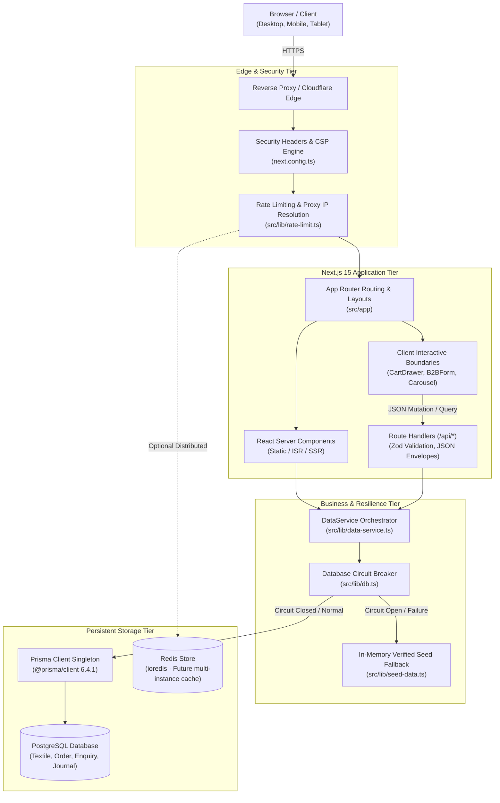
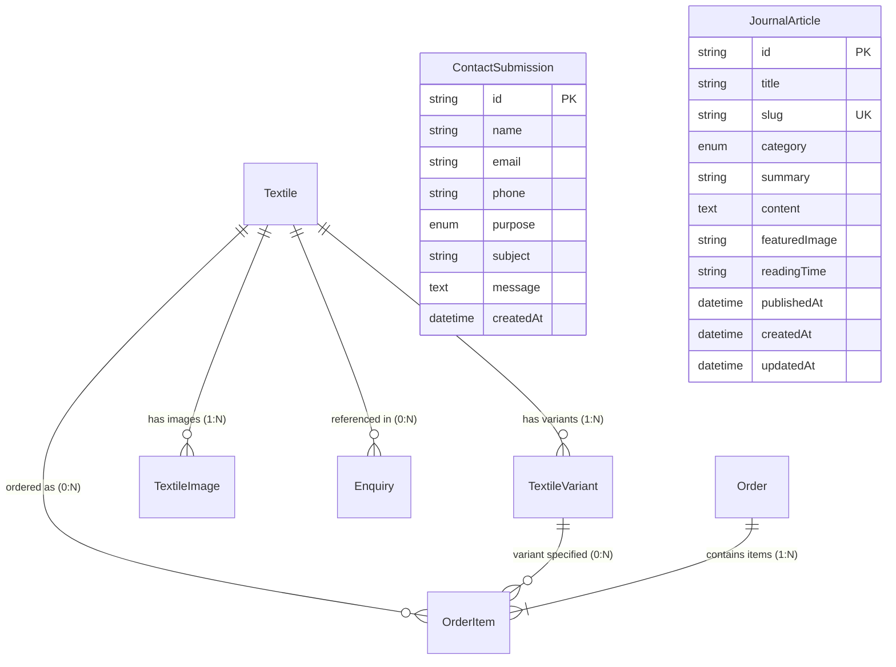
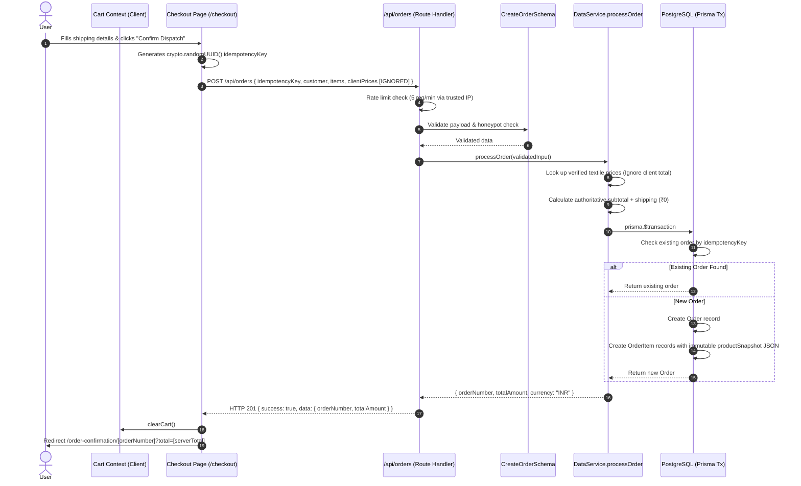
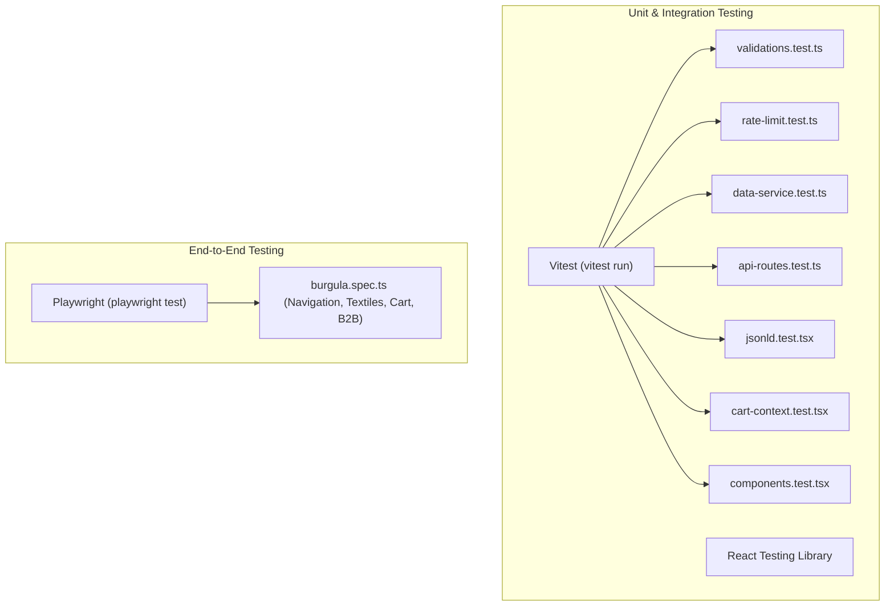
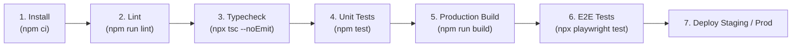
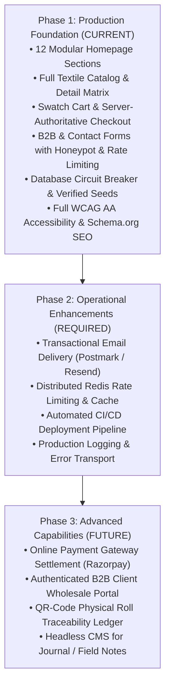

# Burgula Cotton Digital Platform — Technical Requirements Document

**Document Title:** Burgula Cotton Digital Platform — Technical Requirements Document  
**Document Type:** Technical Requirements Document (TRD)  
**Version:** 1.0  
**Status:** Official Technical Source of Truth  
**Product:** Burgula Cotton Digital Platform  
**Related Product Document:** [PRD.md](file:///c:/Users/LENOVO/Desktop/websites/cotton%20trust%20burgula/PRD.md)  
**Last Updated:** 2026-09-10  
**Technical Status:** Implementation-Ready  
**Target Repository:** `cotton trust burgula` (Next.js 15.2.0, React 19, TypeScript 5.7, Prisma 6.4.1, PostgreSQL)  

> This document translates the approved product specifications defined in PRD.md into an authoritative technical architecture and implementation standard. Engineering, DevOps, QA, and security practices must adhere to the boundaries, models, protocols, and contracts established herein.

---

## Document History

| Version | Date | Status | Description |
|---|---|---|---|
| 1.0 | 2026-09-10 | Official Technical Source of Truth | Initial production-grade TRD derived from approved PRD and verified repository architecture. |

---

## Table of Contents
1. [Technical Principles](#1-technical-principles)
2. [Existing Technology Stack](#2-existing-technology-stack)
3. [System Architecture](#3-system-architecture)
4. [Application Architecture](#4-application-architecture)
5. [Directory & Module Architecture](#5-directory--module-architecture)
6. [Page & Route Architecture](#6-page--route-architecture)
7. [Database Architecture](#7-database-architecture)
8. [Database Integrity](#8-database-integrity)
9. [Data Access Architecture](#9-data-access-architecture)
10. [API Architecture](#10-api-architecture)
11. [API Response Contract](#11-api-response-contract)
12. [Validation Architecture](#12-validation-architecture)
13. [Security Architecture](#13-security-architecture)
14. [Rate Limiting Architecture](#14-rate-limiting-architecture)
15. [Cart Architecture](#15-cart-architecture)
16. [Checkout & Order Architecture](#16-checkout--order-architecture)
17. [B2B Enquiry Architecture](#17-b2b-enquiry-architecture)
18. [Contact Architecture](#18-contact-architecture)
19. [Textile Catalog Architecture](#19-textile-catalog-architecture)
20. [Journal Architecture](#20-journal-architecture)
21. [Image & Media Architecture](#21-image--media-architecture)
22. [Frontend Architecture](#22-frontend-architecture)
23. [Server vs. Client Component Strategy](#23-server-vs-client-component-strategy)
24. [State Management](#24-state-management)
25. [Error Handling](#25-error-handling)
26. [Observability & Logging](#26-observability--logging)
27. [SEO Technical Architecture](#27-seo-technical-architecture)
28. [Performance Architecture](#28-performance-architecture)
29. [Accessibility Architecture](#29-accessibility-architecture)
30. [Testing Architecture](#30-testing-architecture)
31. [CI/CD & Quality Gates](#31-cicd--quality-gates)
32. [Environment Configuration](#32-environment-configuration)
33. [Deployment Architecture](#33-deployment-architecture)
34. [Backup, Recovery & Data Retention](#34-backup-recovery--data-retention)
35. [Future Integrations](#35-future-integrations)
36. [Technical Risk Register](#36-technical-risk-register)
37. [Technical Debt Register](#37-technical-debt-register)
38. [Non-Functional Requirements (NFR)](#38-non-functional-requirements-nfr)
39. [Traceability Matrix](#39-traceability-matrix)
40. [Implementation Phases](#40-implementation-phases)
41. [Production Readiness Checklist](#41-production-readiness-checklist)
42. [Architecture Decision Records (ADRs)](#42-architecture-decision-records-adrs)
43. [Open Technical Questions](#43-open-technical-questions)
44. [Final Architecture Summary](#44-final-architecture-summary)

---

## 1. Technical Principles

The engineering implementation for the Burgula Cotton web platform follows senior-level production engineering standards. The platform is not a prototype, proof-of-concept, or "vibe-coded" demo; it is an enterprise-grade corporate and B2B textile digital platform.

1. **Production-First Architecture:** Code must be structured for long-term maintainability, strict typing, complete isolation of concerns, and zero runtime surprises.
2. **Security by Default:** Zero trust in client-supplied inputs, prices, or headers. Server-authoritative calculations govern all sensitive transactions.
3. **Least Privilege & Secret Isolation:** Database credentials and infrastructure secrets remain exclusively in server execution contexts. Zero client bundle exposure.
4. **Strong Input Boundary Validation:** Every network boundary (HTTP query strings, path parameters, request bodies) is guarded by strict Zod schemas with bounded string lengths and format regexes.
5. **Separation of Concerns:** Strict decoupling between presentation (UI/components), business orchestration (`DataService`), persistence (`PrismaClient`), and transport (`NextRequest`/`NextResponse`).
6. **Reusable Modular Components:** Standardized primitives (cards, buttons, typography tokens) without utility sprawl or ad-hoc inline styles.
7. **Database Integrity Over Speed:** Strict foreign key relations, cascade/set-null rules, and database-level unique constraints. Price and product specifications are captured as immutable JSON snapshots at order creation.
8. **Explicit Error Handling & Circuit Breaking:** Graceful degradation under network or database failure via circuit-breaker mechanics, returning verified seed data rather than throwing unhandled 500 errors to end users.
9. **Observability Without PII Leakage:** Structured server-side error logging with sanitized stack traces. Zero logging of passwords, authorization headers, or sensitive user PII.
10. **A11y & SEO as Core Engineering:** WCAG 2.1 Level AA compliance, semantic HTML5, keyboard focus traps, reduced-motion queries, and machine-readable Schema.org JSON-LD built directly into page templates.
11. **Minimal Dependencies & Avoidance of Over-Engineering:** Rely on native Web APIs, Next.js built-ins, and standard Node primitives. Avoid premature framework additions (e.g., Redux, GraphQL, microfrontends).

---

## 2. Existing Technology Stack

The following stack represents the actual detected and verified technologies in the repository:

| Layer / Tool | Version | Purpose | Implementation Status | Verification Evidence |
|---|---|---|---|---|
| **Next.js** | `15.2.0` | Full-stack framework (App Router, Server Components, API routes) | `[CURRENT]` | `package.json`, `next.config.ts`, `src/app/` |
| **React** | `19.0.0` | UI component library (concurrent rendering, transitions) | `[CURRENT]` | `package.json`, `src/components/` |
| **React DOM** | `19.0.0` | DOM renderer | `[CURRENT]` | `package.json` |
| **TypeScript** | `5.7.3` | Static type checking and compiler safety | `[CURRENT]` | `tsconfig.json`, `package.json` (`strict: true`) |
| **CSS Modules / Vanilla CSS** | Native | Scoped component styling and design token distribution | `[CURRENT]` | `src/styles/globals.css`, `src/styles/tokens.css`, `*.module.css` |
| **Prisma ORM** | `6.4.1` | Database mapping, migrations, typed SQL queries | `[CURRENT]` | `prisma/schema.prisma`, `src/lib/db.ts` |
| **PostgreSQL** | 15+ compatible | Persistent relational relational data store | `[CURRENT]` (local fallback ready) | `prisma/schema.prisma` datasource block |
| **Zod** | `3.24.2` | Runtime data validation and TypeScript inference | `[CURRENT]` | `src/lib/validations/index.ts` |
| **ioredis** | `5.5.0` | Distributed cache & rate limiting client | `[CURRENT]` (Installed; in-memory fallback active) | `package.json`, `src/lib/rate-limit.ts` |
| **Lucide React** | `1.16.0` | Iconography primitives | `[CURRENT]` | `package.json`, `src/components/` |
| **Vitest** | `3.0.7` | High-speed unit & integration test runner | `[CURRENT]` | `vitest.config.ts`, `src/__tests__/` (7 test suites) |
| **Testing Library (React / Jest-DOM)** | `16.2.0` / `6.6.3` | React component DOM testing utilities | `[CURRENT]` | `package.json`, `src/__tests__/` |
| **Playwright** | `1.50.1` | End-to-end browser automation framework | `[CURRENT]` | `playwright.config.ts`, `e2e/burgula.spec.ts` |
| **ESLint** | `9.21.0` | Static code analysis and linting | `[CURRENT]` | `eslint.config.mjs`, `package.json` |
| **Payment Gateway (Razorpay/Stripe)** | N/A | Automated checkout payment settlement | `[FUTURE / OPEN QUESTION]` | Schema reserves fields; no active client |
| **Transactional Email (Postmark/SES/Resend)** | N/A | Automated order/enquiry email delivery | `[FUTURE / OPEN QUESTION]` | Stored in DB; outbound worker planned |

---

## 3. System Architecture



### Layer Responsibilities
1. **Edge & Security Layer:** Enforces Content-Security-Policy, HSTS, frame-ancestors, referrer policy, and rate limits via trusted client IP extraction.
2. **Next.js App Layer:** Renders lightweight, SEO-rich Server Components by default; isolates Client Components (`'use client'`) strictly to interactive trees.
3. **Route Handlers (`/api/*`):** Process incoming mutations, validate inputs with Zod, reject bot submissions via honeypots, and return standard JSON response envelopes.
4. **DataService Layer:** Houses all business rules, including server-side price snapshots, order creation transactions, search aggregation, and fallback routing.
5. **Database & Circuit-Breaker Tier:** Maintains referential integrity through Prisma ORM. Automatically trips open during database disconnections to serve static verified seed data, preventing cascading 500 errors.

---

## 4. Application Architecture

```
src/
├── app/                  # Next.js App Router root
│   ├── layout.tsx        # Root layout, Google Font loader, CartProvider wrapper
│   ├── page.tsx          # Homepage (12 modular server/client sections)
│   ├── error.tsx         # Global client error boundary
│   ├── not-found.tsx     # Global branded 404 handler
│   ├── sitemap.ts        # Dynamic XML sitemap generator with stable dates
│   ├── robots.ts         # Search engine crawler directives
│   ├── api/              # Route handlers (/b2b, /contact, /orders, /search, /textiles, /journal)
│   ├── about/            # Trust institutional profile page
│   ├── our-story/        # Historical village narrative & Kapas se Kapda Tak
│   ├── capabilities/     # Technical production infrastructure & process matrix
│   ├── textiles/         # Textile library & dynamic [slug] detail pages
│   ├── our-impact/       # Weaver livelihood security & decentralization impact
│   ├── our-vision/       # Long-term rural agrarian industrial roadmap
│   ├── b2b/              # Dedicated commercial procurement inquiry page
│   ├── checkout/         # Swatch dispatch address & order submission form
│   ├── order-confirmation/ # Verified order receipt page
│   ├── journal/          # Field notes editorial index & [slug] article reader
│   ├── contact/          # General and institutional contact routing
│   └── search/           # Multi-entity search interface
├── components/           # Modular presentation & client components
│   ├── cart/             # CartDrawer, SwatchAction, CartItemRow
│   ├── layout/           # Header, Navigation, Footer, MobileNav
│   ├── home/             # CottonJourneyCarousel, InfrastructureSection, Hero
│   ├── textiles/         # FabricCard, SpecificationMatrix, RelatedTextiles
│   └── ui/               # Button, Input, Modal, Badge primitives
├── context/              # Client state providers (CartContext with localStorage sync)
├── lib/                  # Core singletons, services, validations, helpers
│   ├── db.ts             # Prisma client singleton + circuit breaker
│   ├── data-service.ts   # Core business data service layer
│   ├── rate-limit.ts     # In-memory / Redis rate limiting with proxy anti-spoofing
│   ├── api-response.ts   # Standard API envelope builders
│   ├── seed-data.ts      # Immutable verified seed dataset (fallback source)
│   └── validations/      # Zod validation schemas (B2B, Orders, Contact, Search)
├── constants/            # Static configuration & homepage section copy
└── styles/               # Design tokens, variables, and global CSS resets
```

---

## 5. Directory & Module Architecture

| Directory | Responsibility | Constraint / Rule |
|---|---|---|
| `src/app/` | Routing, Page entry points, Metadata, Layouts | Minimal presentation logic; delegates to `components/` and `DataService`. |
| `src/app/api/` | RESTful API route handlers | Only HTTP request handling, rate limiting, and Zod parsing. No direct SQL queries. |
| `src/components/` | Reusable React UI components | Server Components by default; mark `'use client'` only when hook/DOM state is required. |
| `src/context/` | Client-side React context | Restricted to client state that spans multiple routes (e.g., `CartContext`). |
| `src/lib/` | Reusable business logic, DB access, utilities | Stateless or singleton utilities. Must remain framework-agnostic where possible. |
| `src/lib/validations/` | Zod schema definitions | Authoritative input validation source shared across client forms and server route handlers. |
| `src/styles/` | Global tokens and CSS variables | Pure Vanilla CSS; CSS Modules for component encapsulation; zero runtime CSS-in-JS. |
| `prisma/` | Schema definition, migrations, seed script | Single source of truth for the relational PostgreSQL schema. |
| `public/images/` | Static visual assets, macro textures | Optimized, descriptive naming; served via `next/image` with WebP/AVIF output. |

---

## 6. Page & Route Architecture

| Route Path | Type | Rendering Strategy | Data Source | Auth | SEO Directives | Status |
|---|---|---|---|---|---|---|
| `/` | Page | Static (ISR Revalidated) | `DataService.getTextiles()`, `getJournalArticles()` | None | `index, follow` (Priority: 1.0) | `[CURRENT]` |
| `/about` | Page | Static (SSG) | Static Constants | None | `index, follow` (Priority: 0.8) | `[CURRENT]` |
| `/our-story` | Page | Static (SSG) | Static Constants | None | `index, follow` (Priority: 0.8) | `[CURRENT]` |
| `/capabilities` | Page | Static (SSG) | Static Constants | None | `index, follow` (Priority: 0.8) | `[CURRENT]` |
| `/textiles` | Page | Dynamic (SSR / On-Demand) | `DataService.getTextiles()` | None | `index, follow` (Priority: 0.9) | `[CURRENT]` |
| `/textiles/[slug]` | Page | Dynamic (SSR / On-Demand) | `DataService.getTextileBySlug()` | None | `index, follow`, Product JSON-LD | `[CURRENT]` |
| `/our-impact` | Page | Static (SSG) | Static Constants | None | `index, follow` (Priority: 0.8) | `[CURRENT]` |
| `/our-vision` | Page | Static (SSG) | Static Constants | None | `index, follow` (Priority: 0.8) | `[CURRENT]` |
| `/b2b` | Page | Static (Form Client Boundary) | None (Client Form Mutation) | None | `index, follow` (Priority: 0.8) | `[CURRENT]` |
| `/checkout` | Page | Client Only (`'use client'`) | `CartContext` | None | `noindex, nofollow` | `[CURRENT]` |
| `/order-confirmation/[orderNumber]` | Page | Dynamic (SSR) | Query Parameters / URL params | None | `noindex, nofollow` | `[CURRENT]` |
| `/journal` | Page | Dynamic (SSR / Filterable) | `DataService.getJournalArticles()` | None | `index, follow` (Priority: 0.7) | `[CURRENT]` |
| `/journal/[slug]` | Page | Dynamic (SSR) | `DataService.getJournalArticleBySlug()` | None | `index, follow`, Article JSON-LD | `[CURRENT]` |
| `/contact` | Page | Static (Form Client Boundary) | None (Client Form Mutation) | None | `index, follow` (Priority: 0.6) | `[CURRENT]` |
| `/search` | Page | Client Only (`'use client'`) | `/api/search` | None | `noindex, follow` | `[CURRENT]` |
| `/sitemap.xml` | Utility | Server Route | Static seed metadata | None | Sitemap XML endpoint | `[CURRENT]` |
| `/robots.txt` | Utility | Server Route | Static crawler configuration | None | Robots text endpoint | `[CURRENT]` |

---

## 7. Database Architecture

The persistent database layer is defined via Prisma ORM (`prisma/schema.prisma`) targeting PostgreSQL.

### Schema Entities Summary



### Model Specifications

#### 1. `Textile`
- **Purpose:** Primary material entity representing a verified fabric line.
- **Fields:** `id` (UUID PK), `code` (Unique String, e.g. "BC-KOR-01"), `name`, `slug` (Unique String), `shortDescription`, `materialStory` (Text), `yarnCount`, `weave`, `width`, `gsm`, `finish`, `suggestedApplications`, `inStock` (Boolean default true), `leadTime`, `b2bMoq`, `basePrice` (Decimal 10,2), `swatchPrice` (Decimal 10,2 default 150.00), `samplePrice` (Decimal 10,2 default 600.00), `isFeatured` (Boolean default false), `heroImage`, `macroImage`, `createdAt`, `updatedAt`.
- **Indexes:** `@@index([slug])`, `@@index([isFeatured])`.

#### 2. `TextileVariant`
- **Purpose:** Colorway or weave variation of a base fabric.
- **Fields:** `id` (UUID PK), `textileId` (FK -> Textile.id, onDelete: Cascade), `colorName`, `colorHex`, `price` (Decimal 10,2 nullable), `isAvailable` (Boolean default true), `imageUrl`, `createdAt`, `updatedAt`.
- **Indexes:** `@@index([textileId])`.

#### 3. `TextileImage`
- **Purpose:** High-resolution gallery and macro texture imagery.
- **Fields:** `id` (UUID PK), `textileId` (FK -> Textile.id, onDelete: Cascade), `url`, `altText`, `isMacro` (Boolean default false), `sortOrder` (Int default 0).
- **Indexes:** `@@index([textileId])`.

#### 4. `Enquiry`
- **Purpose:** B2B commercial trade leads, custom developments, and wholesale RFPs.
- **Fields:** `id` (UUID PK), `enquiryNumber` (Unique String, e.g. "ENQ-2026-XXXXX"), `companyName`, `contactName`, `email`, `phone`, `buyerType` (Enum: `DESIGNER`, `FASHION_LABEL`, `MANUFACTURER`, `ARCHITECT`, `HOSPITALITY`, `RETAILER`, `PROFESSIONAL_BUYER`, `OTHER`), `intendedUse`, `preferredTextileId` (FK -> Textile.id nullable, onDelete: SetNull), `approximateQuantity`, `timeline`, `customRequirement` (Text), `status` (String default "NEW"), `createdAt`, `updatedAt`.
- **Indexes:** `@@index([enquiryNumber])`, `@@index([email])`.

#### 5. `Order`
- **Purpose:** Physical swatch and sample dispatch requests.
- **Fields:** `id` (UUID PK), `orderNumber` (Unique String, e.g. "BC-2026-XXXXX"), `idempotencyKey` (Unique String nullable), `customerName`, `email`, `phone`, `shippingAddressLine1`, `shippingAddressLine2`, `city`, `state`, `postalCode`, `country` (default "India"), `subtotal` (Decimal 10,2), `shippingAmount` (Decimal 10,2 default 0.00), `taxAmount` (Decimal 10,2 default 0.00), `discountAmount` (Decimal 10,2 default 0.00), `totalAmount` (Decimal 10,2), `currency` (default "INR"), `paymentStatus` (Enum: `PENDING`, `AUTHORIZED`, `PAID`, `FAILED`, `REFUNDED`), `paymentProvider` (String nullable), `paymentOrderId`, `paymentTransactionId`, `orderStatus` (Enum: `PENDING`, `CONFIRMED`, `PROCESSING`, `DISPATCHED`, `COMPLETED`, `CANCELLED`), `createdAt`, `updatedAt`.
- **Indexes:** `@@index([orderNumber])`, `@@index([email])`, `@@index([idempotencyKey])`.

#### 6. `OrderItem`
- **Purpose:** Line item belonging to an Order with immutable purchase-time snapshot.
- **Fields:** `id` (UUID PK), `orderId` (FK -> Order.id, onDelete: Cascade), `textileId` (FK -> Textile.id nullable, onDelete: SetNull), `variantId` (FK -> TextileVariant.id nullable, onDelete: SetNull), `itemType` (Enum: `SWATCH`, `SAMPLE_CUT`, `FABRIC_METER`), `quantity` (Int), `unitPrice` (Decimal 10,2), `totalPrice` (Decimal 10,2), `productSnapshot` (JSON), `createdAt`.
- **Indexes:** `@@index([orderId])`.

#### 7. `ContactSubmission`
- **Purpose:** Non-procurement inquiries, academic collaborations, workshop requests.
- **Fields:** `id` (UUID PK), `name`, `email`, `phone`, `purpose` (Enum: `FABRIC_ENQUIRY`, `B2B_BULK`, `FABRIC_DEVELOPMENT`, `COLLABORATION`, `GENERAL`), `subject`, `message` (Text), `createdAt`.
- **Indexes:** `@@index([email])`.

#### 8. `JournalArticle`
- **Purpose:** Technical field notes, monograph articles, and artisan research.
- **Fields:** `id` (UUID PK), `title`, `slug` (Unique String), `category` (Enum: `MATERIAL`, `PEOPLE`, `PLACE`, `PROCESS`, `RESEARCH`, `CONTEMPORARY`), `summary`, `content` (Text), `featuredImage`, `readingTime`, `publishedAt`, `seoTitle`, `seoDescription`, `canonicalUrl`, `createdAt`, `updatedAt`.
- **Indexes:** `@@index([slug])`, `@@index([category])`.

---

## 8. Database Integrity

1. **Foreign Key Constraints:**
   - Deleting a `Textile` automatically cascades and deletes related `TextileVariant` and `TextileImage` rows.
   - Deleting a `Textile` sets `preferredTextileId` in `Enquiry` to `NULL` (preserves the historical lead).
   - Deleting a `Textile` sets `textileId` in `OrderItem` to `NULL` (preserves historical financial records).
   - Deleting an `Order` cascades and deletes associated `OrderItem` rows.
2. **Transactional Consistency:**
   - Order creation executes inside `prisma.$transaction`.
   - The transaction atomically verifies idempotency, writes the `Order`, and creates all `OrderItem` records. If any item validation fails, the entire transaction rolls back.
3. **Immutable Price Snapshots:**
   - Catalog price changes must never alter historic orders.
   - Every `OrderItem` stores `productSnapshot: { code, name, weave, yarnCount, variantColor, capturedPrice }` directly in a PostgreSQL JSON column.
4. **Authoritative Server Pricing:**
   - Client-calculated totals are completely ignored.
   - Prices are read directly from server records: `SWATCH` = ₹150.00, `SAMPLE_CUT` = ₹600.00, `FABRIC_METER` = basePrice.

---

## 9. Data Access Architecture

### Circuit Breaker & Fallback Architecture
To prevent local development blocking and avoid user-facing 500 downtime if PostgreSQL is unreachable, `src/lib/db.ts` and `src/lib/data-service.ts` implement an automated circuit-breaker pattern:

```mermaid
graph TD
    Req["DataService Call"] --> Check{"isDbAvailable()?"}
    Check -->|Yes (Circuit Closed)| TryPrisma["Execute Prisma Query"]
    Check -->|No (Circuit Open / Cooldown)| Fallback["Serve in-memory verified seeds<br/>(src/lib/seed-data.ts)"]
    
    TryPrisma -->|Query Success| ReturnData["Return Database Rows"]
    TryPrisma -->|DB Error / Connection Refused| Trip["openCircuit()<br/>Set 60s Cooldown"]
    Trip --> Fallback
```

- **Circuit Cooldown:** 60 seconds (`cooldownMs: 60_000`).
- **Half-Open State:** After 60 seconds, the next incoming request attempts a fresh connection.
- **Production Logging:** Errors are logged with `console.error('[db] Database connection failure — serving in-memory fallback.')` in production environments without exposing internal details to clients.

---

## 10. API Architecture

All routes exist in `src/app/api/` as Next.js Route Handlers:

| Endpoint | Method | Rate Limit | Purpose | Validation Schema | Success | Error Codes |
|---|---|---|---|---|---|---|
| `/api/textiles` | GET | 60 req/min | Filterable textile catalog | `TextilesQuerySchema` | 200 OK | `400`, `500` |
| `/api/textiles/[slug]` | GET | 60 req/min | Single fabric specification | Path string check | 200 OK | `404`, `500` |
| `/api/b2b` | POST | 5 req/min | Submit B2B trade enquiry | `B2BEnquirySchema` | 201 Created | `400`, `429`, `500` |
| `/api/orders` | POST | 5 req/min | Submit sample dispatch order | `CreateOrderSchema` | 201 Created | `400`, `429`, `500` |
| `/api/contact` | POST | 5 req/min | Submit contact inquiry | `ContactSubmissionSchema` | 201 Created | `400`, `429`, `500` |
| `/api/search` | GET | 60 req/min | Multi-entity unified search | `SearchQuerySchema` | 200 OK | `400`, `500` |
| `/api/journal` | GET | 60 req/min | Filterable journal articles | `JournalQuerySchema` | 200 OK | `400`, `500` |

---

## 11. API Response Contract

All API responses strictly conform to the standard envelope defined in `src/lib/api-response.ts`:

### Success Envelope (HTTP 200 / 201)
```json
{
  "success": true,
  "data": { ... },
  "timestamp": "2026-09-10T16:30:00.000Z"
}
```

### Error Envelope (HTTP 400 / 404 / 429 / 500)
```json
{
  "success": false,
  "error": {
    "code": "VALIDATION_ERROR",
    "message": "Invalid order details",
    "details": {
      "email": ["Please provide a valid email address"]
    }
  },
  "timestamp": "2026-09-10T16:30:00.000Z"
}
```

### Standard Error Codes (`ErrorCode` Enum)
- `VALIDATION_ERROR`: Input failed Zod validation or honeypot was triggered (HTTP 400).
- `UNAUTHORIZED`: Request lacking necessary credentials (HTTP 401).
- `FORBIDDEN`: Request authenticated but not allowed (HTTP 403).
- `NOT_FOUND`: Requested entity does not exist (HTTP 404).
- `CONFLICT`: Unique constraint or idempotency collision (HTTP 409).
- `RATE_LIMITED`: Client exceeded sliding-window limit (HTTP 429).
- `PAYMENT_FAILED`: Future payment gateway failure (HTTP 400 / 402).
- `INTERNAL_ERROR`: Sanitized internal server failure (HTTP 500).

---

## 12. Validation Architecture

All input validation is centralized in `src/lib/validations/index.ts` using **Zod (3.24.2)**:

1. **Mutation Schemas (`POST` bodies):**
   - `B2BEnquirySchema`: Validates company name (min 2, max 120), contact name (min 2, max 100), email format, phone digits (min 8, max 20), enum `buyerType`, `intendedUse` (min 3, max 500), and rejects if `website_hp` has length > 0.
   - `CreateOrderSchema`: Validates `idempotencyKey` (min 8), customer details, postal code (min 4, max 20), items array (min 1 item, max quantity 50 per line), and rejects if `website_hp` is populated.
   - `ContactSubmissionSchema`: Validates name, email, enum `purpose`, subject (min 3, max 150), message (min 10, max 3000), and rejects if `website_hp` is populated.
2. **Query Schemas (`GET` query parameters):**
   - `SearchQuerySchema`: Binds `q` string (min 1, max 100) and enum `category: ['all', 'textiles', 'journal']`.
   - `TextilesQuerySchema`: Limits `weave` (max 80 chars), `yarnCount` (max 50 chars), `isFeatured` ('true'|'false'), `search` (max 100 chars).
   - `JournalQuerySchema`: Validates `category` with regex `/^[a-zA-Z0-9_-]*$/` (max 50 chars).

---

## 13. Security Architecture

| Security Control | Implementation Details | Status |
|---|---|---|
| **Content-Security-Policy** | Configured in `next.config.ts`. Enforces `default-src 'self'`, fonts from `fonts.gstatic.com`, styles from `fonts.googleapis.com`, images from `self` and `images.unsplash.com`. | `[CURRENT]` |
| **Strict Transport Security** | `max-age=63072000; includeSubDomains; preload` in HTTP headers. | `[CURRENT]` |
| **Frame Protection** | `X-Frame-Options: SAMEORIGIN` and `frame-ancestors 'self'`. | `[CURRENT]` |
| **MIME Sniffing Defense** | `X-Content-Type-Options: nosniff`. | `[CURRENT]` |
| **Referrer Policy** | `strict-origin-when-cross-origin`. | `[CURRENT]` |
| **Rate Limiting** | Sliding window rate limiting on all mutation routes; trusted proxy extraction. | `[CURRENT]` |
| **Anti-Spam Honeypots** | Hidden `website_hp` input on B2B, Contact, and Order forms. Immediate rejection if filled. | `[CURRENT]` |
| **XSS Prevention** | React automatic JSX escaping; `<JsonLd />` component explicitly escapes `</script>`, `<script`, and `<!--`. | `[CURRENT]` |
| **SQL Injection Defense** | 100% parameterization via Prisma ORM; zero raw string interpolation. | `[CURRENT]` |
| **Sensitive Data Exposure** | Zero stack trace leakage to client; errors mapped to generic strings. No secrets in client bundles. | `[CURRENT]` |
| **CSRF Defense** | Modern SameSite cookie defaults; JSON API endpoints validate Content-Type and custom headers. | `[CURRENT]` |
| **Permissions Policy** | `camera=(), microphone=(), geolocation=(), payment=()` disabled by default. | `[CURRENT]` |

---

## 14. Rate Limiting Architecture

Implemented in `src/lib/rate-limit.ts`:

- **Store:** In-memory `Map<string, RateLimitRecord>` with a hard ceiling of 500 entries (`STORE_MAX_SIZE = 500`).
- **Eviction Strategy:** Opportunistic purge of expired records on every check. If still over capacity, oldest entries are pruned in insertion order.
- **Client IP Resolution (Anti-Spoofing):**
  1. Checks infrastructure-trusted direct headers first: `cf-connecting-ip` (Cloudflare) or `x-real-ip`.
  2. For `x-forwarded-for`: If `TRUSTED_PROXY` is set, splits commas, trims whitespace, and reads from the **rightmost** (trusted edge) address rather than the client-controllable left prefix.
  3. Fallback: `127.0.0.1` for local development.
- **Limits:**
  - Mutation endpoints (`/api/orders`, `/api/b2b`, `/api/contact`): **5 requests per minute**.
  - Query endpoints (`/api/search`, `/api/textiles`, `/api/journal`): **60 requests per minute**.

---

## 15. Cart Architecture

Implemented via `CartContext` (`src/context/CartContext.tsx`) and `CartDrawer` (`src/components/cart/CartDrawer.tsx`):

- **Client State:** React Context synchronized with `localStorage.getItem('burgula_cart')`.
- **Composite Item Key:** Line items are uniquely keyed by `${textileId}-${itemType}-${variantId || 'default'}`.
- **Deduplication:** Adding an existing swatch increments its `quantity` rather than creating duplicate rows.
- **Item Cap:** Maximum quantity is capped at 50 units per line item.
- **Hydration Safety:** `mounted` boolean prevents Next.js SSR hydration mismatch with `localStorage`.
- **Accessibility:**
  - Focus trap locks keyboard Tab navigation inside `CartDrawer` when opened.
  - `Escape` key listener closes the drawer and restores focus to the invoking trigger button.
  - `aria-modal="true"`, `role="dialog"`, and `aria-label="Fabric Sample Cart"` attributes applied.

---

## 16. Checkout & Order Architecture



---

## 17. B2B Enquiry Architecture

- **Entry Point:** Dedicated form at `/b2b` and pre-populated query links from `/textiles/[slug]`.
- **Processing:** Handled by `/api/b2b`.
- **Spam Mitigation:** Hidden honeypot `website_hp` and 5 req/min rate limit.
- **Persistence:** Stored in `Enquiry` table with generated identifier `ENQ-YYYY-XXXXX`.
- **Current vs. Future:**
  - `[CURRENT]`: Persistent database lead storage and user confirmation view.
  - `[FUTURE / OPEN QUESTION]`: Outbound transactional email alert to the administrative team and CRM webhook synchronization.

---

## 18. Contact Architecture

- **Entry Point:** Form at `/contact`.
- **Processing:** Handled by `/api/contact`.
- **Spam Mitigation:** Hidden honeypot `website_hp` and 5 req/min rate limit.
- **Persistence:** Stored in `ContactSubmission` table with categorized `purpose` enum.
- **Current vs. Future:**
  - `[CURRENT]`: Database record creation and user confirmation feedback.
  - `[FUTURE / OPEN QUESTION]`: Automated routing to regional Telangana coordinator email.

---

## 19. Textile Catalog Architecture

- **Catalog Page (`/textiles`):** Server Component shell wrapping `TextilesClient.tsx`.
- **Filtering & Search:** Real-time client-side filter pills (weave type, yarn count, keyword) debounced to prevent layout thrashing.
- **Fabric Cards (`FabricCard.tsx`):** Server Component rendering high-resolution product photography, verified technical badges, macro-texture toggle, and `+ Swatch` trigger.
- **Detail Page (`/textiles/[slug]`):**
  - Fetches textile via `DataService.getTextileBySlug(slug)`.
  - Emits `generateMetadata` for dynamic title, description, and OpenGraph tags.
  - Renders `<SpecificationMatrix />` detailing warp/weft counts, width, GSM, finish, and lead times.
  - Injects `Product` Schema.org JSON-LD structured data.

---

## 20. Journal Architecture

- **Index Page (`/journal`):** Displays articles grouped by 6 verified categories (`MATERIAL`, `PEOPLE`, `PLACE`, `PROCESS`, `RESEARCH`, `CONTEMPORARY`).
- **Article Page (`/journal/[slug]`):**
  - Fetches article via `DataService.getJournalArticleBySlug(slug)`.
  - Displays reading time estimate, publication date, author context, and rich-text body.
  - Injects `Article` Schema.org JSON-LD structured data.
- **Current vs. Future:**
  - `[CURRENT]`: Markdown/static text content backed by PostgreSQL / seed records.
  - `[FUTURE]`: Headless CMS integration (e.g., Sanity, Strapi) for direct editorial publishing.

---

## 21. Image & Media Architecture

- **Component:** Exclusively `next/image` (`Image` from `'next/image'`).
- **Formats:** WebP and AVIF prioritized via `next.config.ts` (`formats: ['image/avif', 'image/webp']`).
- **Domains:** Authorized remote patterns for `images.unsplash.com`.
- **Local Media:** Stored in `public/images/` under structured folders (`textiles/`, `hero/`, `journal/`).
- **Responsive Attributes:**
  - Above-the-fold hero imagery uses `priority` and `sizes="100vw"`.
  - Grid cards use `sizes="(max-width: 768px) 100vw, (max-width: 1200px) 50vw, 33vw"`.
  - All images require meaningful, non-empty `alt` attributes.

---

## 22. Frontend Architecture

- **Styling Architecture:** 100% Vanilla CSS and CSS Modules. Zero Tailwind or CSS-in-JS runtime overhead.
- **Design Tokens (`src/styles/tokens.css`):**
  - Background surfaces: `--color-bg-primary: #FAF8F5`, `--color-bg-surface: #F3EFEA`, `--color-bg-dark: #141312`.
  - Typography: Editorial serif headings with clean sans-serif body copy.
  - Spacing scale: Strict 4px/8px rhythm tokens.
- **Responsive Layouts:** Mobile-first media queries (`min-width: 768px`, `min-width: 1024px`, `min-width: 1280px`).

---

## 23. Server vs. Client Component Strategy

| Component | Nature | Reason |
|---|---|---|
| `app/page.tsx` | **Server Component** | Fetches static homepage data on server; outputs lightweight HTML. |
| `FabricCard.tsx` | **Server Component** | Pure presentation; zero hooks needed. |
| `SpecificationMatrix.tsx` | **Server Component** | Static specification table; rendered server-side for maximum SEO. |
| `JsonLd.tsx` | **Server Component** | Static script emission; no client bundle cost. |
| `CartDrawer.tsx` | **Client Component** | Manages open/close state, focus traps, DOM listeners, cart mutations. |
| `CottonJourneyCarousel.tsx` | **Client Component** | Manages auto-scroll timers, touch gestures, keyboard arrows, and pause. |
| `B2BFormClient.tsx` | **Client Component** | Handles client form validation, submission state, and error envelopes. |
| `TextilesClient.tsx` | **Client Component** | Manages interactive search inputs and active filter tag state. |

---

## 24. State Management

- **Global Client State:** Strictly limited to `CartContext` for cart drawer visibility, item collections, and local storage synchronization.
- **Local Component State:** Standard `useState` / `useReducer` for form inputs, carousel slide indices, and tab toggles.
- **Server State:** Handled natively via Next.js Server Components and cache revalidation. No external state libraries (Redux, Zustand, MobX) are required.

---

## 25. Error Handling

- **Page-Level Errors:** Caught by `src/app/error.tsx` (client error boundary), rendering a branded recovery screen with retry capabilities.
- **404 Handling:** Handled by `src/app/not-found.tsx`, providing direct navigation back to the textile library or homepage.
- **API Errors:** Normalized through `createErrorResponse()`. Internal database exceptions are logged on the server and returned to clients as sanitized messages (e.g., `INTERNAL_ERROR: Failed to complete order.`).

---

## 26. Observability & Logging

- **Current Status:** `[CURRENT STATUS: NOT CURRENTLY IMPLEMENTED]` (Standard console logging in place).
- **Sensitive Data Rules:** Zero logging of passwords, tokens, full credit card numbers, or unnecessary personal contact details.
- **Future Integration:** Dedicated privacy-respecting client analytics (e.g., Plausible) and structured server log transport (e.g., Datadog, Axiom).

---

## 27. SEO Technical Architecture

- **Metadata Base:** Configured in `src/app/layout.tsx` using `NEXT_PUBLIC_APP_URL` or `https://burgulacotton.com`.
- **Sitemap (`src/app/sitemap.ts`):** Emits dynamic XML sitemap with stable baseline timestamps (`2025-01-15`) to prevent false cache churn across all 23 routes.
- **Robots (`src/app/robots.ts`):** Allows crawling of public material and story pages; explicitly disallows `/checkout/` and `/order-confirmation/`.
- **Structured Data (Schema.org):**
  - `Organization` and `WebSite` schemas on homepage.
  - `Product` and `Offer` schema on `/textiles/[slug]`.
  - `Article` and `BreadcrumbList` schema on `/journal/[slug]`.
  - All JSON-LD outputs sanitized against script breakout attacks.

---

## 28. Performance Architecture

- **Target Core Web Vitals:**
  - Largest Contentful Paint (LCP): < 2.2 seconds.
  - Cumulative Layout Shift (CLS): < 0.05.
  - Interaction to Next Paint (INP): < 150 ms.
- **Techniques:**
  - Zero heavy third-party UI libraries or CSS frameworks.
  - Server Components minimize client JavaScript bundle size.
  - Parallel query execution using `Promise.all` in search and listing endpoints.
  - Responsive image optimization via `next/image` with WebP/AVIF output.

---

## 29. Accessibility Architecture

Adheres to **WCAG 2.1 Level AA**:

- **Keyboard Navigation:** Full Tab/Shift+Tab traversal across all interactive elements.
- **Focus Trapping:** Active modal dialogs (`CartDrawer`) trap keyboard focus and release it upon close.
- **Reduced Motion:** CSS media query `@media (prefers-reduced-motion: reduce)` disables automatic carousel rotation and transitions.
- **Semantic HTML:** Landmark tags (`<header>`, `<main>`, `<nav>`, `<section>`, `<footer>`) used consistently across all templates.
- **Color Contrast:** Minimum 4.5:1 contrast ratio maintained across all surface palettes.

---

## 30. Testing Architecture

The platform features a multi-tiered automated testing architecture:



- **Unit / Component Test Runner:** Vitest 3.0.7 with JSDOM environment.
- **Verified Test Suites:** 7 files, 40 passing tests.
- **E2E Test Runner:** Playwright 1.50.1 configured for Chromium automation.

---

## 31. CI/CD & Quality Gates

**Current Status:** `[FUTURE / RECOMMENDED IMPLEMENTATION]`

### Recommended Quality Pipeline


---

## 32. Environment Configuration

Defined in `.env` and `.env.example`:

| Variable | Classification | Purpose | Required Context |
|---|---|---|---|
| `NODE_ENV` | Public | Environment mode (`development`, `production`, `test`) | Shared |
| `NEXT_PUBLIC_APP_URL` | Public Client/Server | Canonical site root for sitemaps and absolute metadata | Shared |
| `DATABASE_URL` | Server Secret | PostgreSQL connection string with credentials | Server Only |
| `REDIS_URL` | Server Secret | Redis connection string for distributed caching | Server Only |
| `APP_SECRET` | Server Secret | Cryptographic key for session/payload verification | Server Only |
| `TRUSTED_PROXY` | Server Config | IP or CIDR of trusted reverse proxy (for rate limiting) | Server Only |

---

## 33. Deployment Architecture

- **Deployment Pattern:** Stateless container or Node.js server instance running Next.js standalone server.
- **Platform Agnostic:** Fully deployable to Vercel, AWS ECS/Fargate, Railway, or VPS behind Nginx.
- **Current Status:** `[OPEN QUESTION / REQUIRES VERIFICATION]` (Hosting target to be finalized by business operations).

---

## 34. Backup, Recovery & Data Retention

**Current Status:** `[FUTURE / OPERATIONAL REQUIREMENT]`

- **PostgreSQL Backups:** Automated daily snapshots with 30-day retention and point-in-time recovery (PITR).
- **Data Integrity:** Historical orders retain full customer and financial snapshots; line items must never be deleted.
- **Disaster Recovery Target:** RPO (Recovery Point Objective) < 24 hours; RTO (Recovery Time Objective) < 2 hours.

---

## 35. Future Integrations

All future integrations are strictly classified as `[FUTURE / OPEN QUESTION]`:

1. **Payment Gateway Integration:** Direct payment capture via Razorpay or Stripe for automated swatch settlement.
2. **Transactional Email Webhooks:** Inbound/outbound email dispatch via Postmark, AWS SES, or Resend.
3. **Automated GST E-Invoicing:** Integration with Indian tax compliance APIs for commercial dispatch invoices.
4. **Decentralized Provenance Ledger:** QR code roll passports tracing yarn lots to specific Telangana weavers.
5. **Authenticated B2B Client Portal:** Dedicated trade accounts for wholesale volume buyers.

---

## 36. Technical Risk Register

| Risk ID | Risk Description | Severity | Probability | Impact | Mitigation Strategy | Status |
|---|---|---|---|---|---|---|
| **TR-01** | Database outage causes user-facing 500 errors | High | Low | High | Circuit breaker switches automatically to verified in-memory seeds | Mitigated |
| **TR-02** | Client alters swatch prices in browser | Critical | Medium | High | Server completely ignores client prices and calculates authoritative totals | Mitigated |
| **TR-03** | Automated spam floods B2B / Contact forms | Medium | High | Medium | Honeypot input (`website_hp`) + sliding-window IP rate limiting | Mitigated |
| **TR-04** | Header spoofing bypasses rate limiter | High | Medium | Medium | Rate limiter resolves rightmost IP via trusted proxy headers | Mitigated |
| **TR-05** | Image assets degrade Core Web Vitals | Medium | Medium | Medium | Strict `next/image` sizing, priority flags, and modern format encoding | Mitigated |

---

## 37. Technical Debt Register

| Item | Description | Severity | Category | Remediation Plan |
|---|---|---|---|---|
| **TD-01** | In-memory rate limiting not synchronized across multi-container clusters | Medium | Infrastructure | Connect `ioredis` to shared Redis instance in multi-instance production. |
| **TD-02** | No automated email notification on B2B lead creation | Low | Integration | Provision SMTP / transactional email provider in Phase 2. |
| **TD-03** | Lack of automated CI/CD pipeline in repository | Low | DevOps | Configure GitHub Actions / GitLab CI quality pipeline. |

---

## 38. Non-Functional Requirements (NFR)

- **Security:** Zero plaintext secrets in version control; 100% parameterization; strict CSP headers.
- **Performance:** LCP < 2.2s; initial JS bundle payload < 120KB per page.
- **Availability:** 99.9% uptime target, backed by database circuit-breaker fallback.
- **Maintainability:** Strict TypeScript (`strict: true`), 0 ESLint warnings, 100% CSS module isolation.
- **Accessibility:** 100% WCAG 2.1 AA compliance across all public views.

---

## 39. Traceability Matrix

| PRD Requirement | Technical Requirement | Affected Module | API / DB Dependency | Verification Method | Status |
|---|---|---|---|---|---|
| **BC-HOME-001** | Cinematic Full-Screen Hero | `src/app/page.tsx` | None | Visual & E2E inspection | Implemented |
| **BC-HOME-002** | Cotton Journey 8-stage Carousel | `CottonJourneyCarousel.tsx` | None | Vitest & reduced-motion tests | Implemented |
| **BC-TXT-001** | Filterable Textile Archive | `TextilesClient.tsx` | `Textile`, `TextileVariant` | Vitest & API route tests | Implemented |
| **BC-TXT-003** | Technical Specification Matrix | `SpecificationMatrix.tsx` | `Textile` | Unit tests & E2E checks | Implemented |
| **BC-B2B-001** | B2B Lead Form with Honeypot | `B2BFormClient.tsx` | `/api/b2b`, `Enquiry` | Zod & API integration tests | Implemented |
| **BC-CART-001** | Interactive Accessible Cart Drawer | `CartDrawer.tsx` | `CartContext.tsx` | Focus trap & Escape unit tests | Implemented |
| **BC-CHK-001** | Server-Authoritative Checkout | `src/app/checkout/page.tsx` | `/api/orders`, `Order` | Pricing & idempotency tests | Implemented |
| **BC-SEC-001** | Rate Limiter Anti-Spoofing | `src/lib/rate-limit.ts` | Edge Headers | Unit tests with mock headers | Implemented |
| **BC-REL-001** | Database Circuit Breaker | `src/lib/db.ts` | `DataService.ts` | Data service disconnection tests | Implemented |
| **BC-SEO-002** | Schema.org Structured Data | `src/components/seo/JsonLd.tsx` | Dynamic Routes | Script breakout test suite | Implemented |

---

## 40. Implementation Phases



---

## 41. Production Readiness Checklist

| Verification Item | Requirement | Status | Evidence / Command |
|---|---|---|---|
| **Lint Check** | 0 ESLint warnings or errors | **PASS** | `npm run lint` |
| **Type Check** | 0 TypeScript compiler errors | **PASS** | `npx tsc --noEmit` |
| **Unit Test Suite** | 100% test pass rate across 7 test suites | **PASS** | `npm test` (40/40 tests passing) |
| **Production Build** | Clean build with 23/23 routes generated | **PASS** | `npm run build` |
| **Security Headers** | CSP, HSTS, X-Frame-Options configured | **PASS** | `next.config.ts` |
| **Rate Limiting** | Anti-spoofing header check active | **PASS** | `rate-limit.test.ts` |
| **Database Circuit Breaker** | Graceful fallback on database disconnect | **PASS** | `data-service.test.ts` |
| **Accessibility** | Focus trap, Escape listener, reduced motion | **PASS** | `CartDrawer.tsx`, `CottonJourneyCarousel.tsx` |
| **SEO Integrity** | Stable XML sitemaps and valid JSON-LD | **PASS** | `sitemap.ts`, `jsonld.test.tsx` |

---

## 42. Architecture Decision Records (ADRs)

### ADR-01: Adoption of Vanilla CSS & CSS Modules over Tailwind CSS
- **Decision:** Use native CSS Modules and tokens (`tokens.css`).
- **Reason:** Provides complete design flexibility, eliminates utility framework lock-in, ensures zero runtime CSS-in-JS overhead, and matches the quiet, bespoke aesthetic of a luxury textile house.
- **Status:** `[CURRENT]`

### ADR-02: Server-Authoritative Pricing Calculation
- **Decision:** Client cart sends only product and variant IDs; server looks up verified prices and computes total.
- **Reason:** Eliminates client-side price tampering and cart manipulation attacks.
- **Status:** `[CURRENT]`

### ADR-03: In-Memory Database Circuit Breaker
- **Decision:** Implement an in-memory circuit breaker that catches Prisma disconnections and falls back to verified static seed data.
- **Reason:** Guarantees zero downtime on read operations during local development or transient database connectivity failures.
- **Status:** `[CURRENT]`

### ADR-04: Trusted Proxy Rate Limiting Extraction
- **Decision:** Extract client IP using Cloudflare direct headers and rightmost `X-Forwarded-For` parsing.
- **Reason:** Prevents malicious attackers from spoofing client IPs via fabricated request headers to bypass rate limits.
- **Status:** `[CURRENT]`

---

## 43. Open Technical Questions

1. **Transactional Email Provider [OPEN QUESTION]:** Final selection between Postmark, Resend, or AWS SES for outbound B2B lead and order confirmation notifications.
2. **Production Hosting Platform [OPEN QUESTION]:** Final selection of production infrastructure (Vercel vs. AWS ECS vs. self-hosted VPS).
3. **Payment Gateway Provider [FUTURE / OPEN QUESTION]:** Selection of payment aggregator (Razorpay vs. Stripe) when online checkout settlement is activated in Phase 3.
4. **GST E-Invoicing Provider [FUTURE / OPEN QUESTION]:** Decision on whether to integrate direct Indian GST portal APIs or process invoices via offline enterprise ERP.

---

## 44. Final Architecture Summary

- **Frontend:** Next.js 15.2 App Router, React 19, CSS Modules, Google Fonts, Lucide Icons, WCAG 2.1 AA accessible primitives.
- **Backend:** Next.js Route Handlers, Zod 3.24 boundary validation, in-memory sliding window rate limiting.
- **Database:** Prisma ORM 6.4.1 targeting PostgreSQL, protected by an automatic circuit breaker with verified seed fallbacks.
- **Security:** Strict Content-Security-Policy, anti-spoofing IP resolution, anti-spam honeypot inputs, XSS-safe JSON-LD, 100% SQL parameterization.
- **Testing:** Vitest + React Testing Library (unit/integration) and Playwright (end-to-end browser automation).
- **SEO:** Machine-readable Schema.org (`Product`, `Article`, `Organization`), stable XML sitemaps, semantic HTML5 structure.
